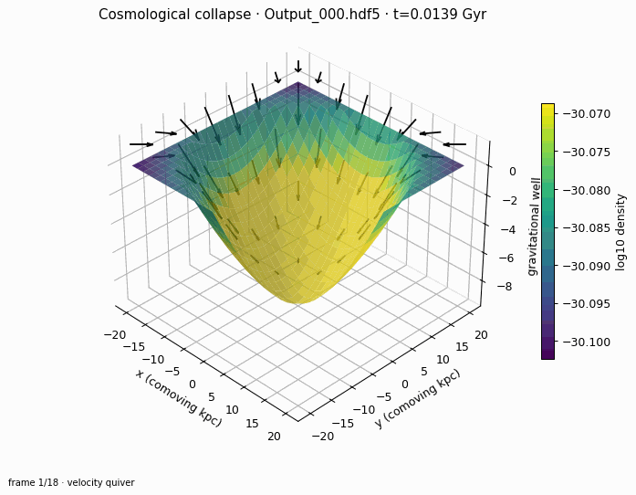
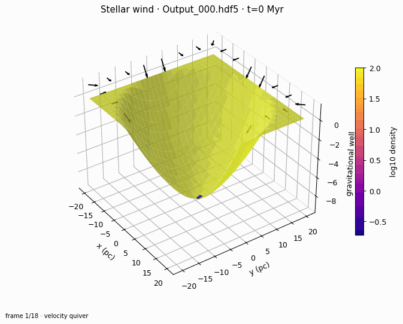

# RadHydropy

RadHydropy is a one-dimensional finite-volume hydrodynamics package for
Cartesian and spherical test problems. It supports ideal-gas fluid evolution,
gravity, thermo-chemistry, radiative transfer, cosmological coordinates, and
HDF5-based initial conditions and snapshots.

RadHydropy supports Python 3.10 and newer. The standard workflow is:

```text
nested YAML → initial condition → Rsim → HDF5 snapshots → typed RadArray views
```

## Get started

Follow the [Getting Started guide](docs/getting_started.rst) for installation,
a first Sod shock-tube run, a minimal Python workflow, and snapshot inspection.

Run the first example directly:

```bash
cd example/SodShock1D
python sodshock1d.py
```

Run examples from their own directories so local helper imports and relative
output paths resolve correctly. The [example matrix](docs/example_matrix.rst)
lists recommended examples by physics area, and the
[troubleshooting guide](docs/troubleshooting.rst) covers common setup and
runtime problems.

## Development

Install optional test and documentation dependencies with:

```bash
python -m pip install -e ".[test,docs]"
```

Run the test suite with:

```bash
python -m pytest
```

The full [documentation](https://tkc004.github.io/RadHydropy/) includes the
[quickstart](docs/quickstart.rst), [architecture](docs/architecture.rst),
[parameter reference](docs/parameters.rst), [snapshot format](docs/snapshots.rst),
[examples](docs/examples.rst), and [API reference](docs/api/index.rst).

## Interactive examples

[](https://tkc004.github.io/RadHydropy/interactive_cosmological_collapse.html)

[](https://tkc004.github.io/RadHydropy/interactive_stellar_wind.html)

Static previews are also available as
[PNG images](docs/_static/images/cosmological-collapse-3d.png) and
[stellar-wind PNG images](docs/_static/images/stellar-wind-3d.png).
