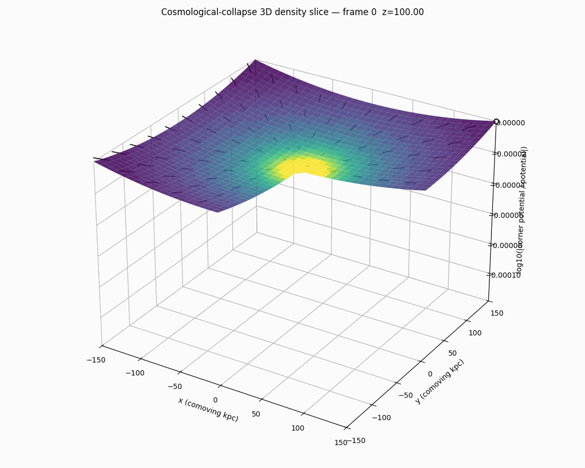
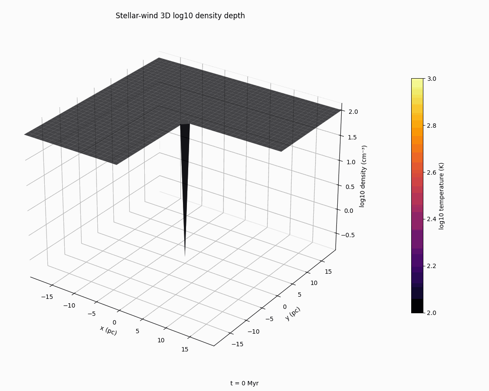

# RadHydropy

RadHydropy is a one-dimensional finite-volume hydrodynamics package for
Cartesian and spherical test problems. It supports ideal-gas fluid evolution,
gravity, thermo-chemistry, radiative transfer, cosmological coordinates, and
HDF5-based initial conditions and snapshots.

RadHydropy supports Python 3.10 and newer. The standard workflow is:

```text
nested YAML → initial condition → Rsim → HDF5 snapshots → typed RadArray views
```


## Get started

Follow the [Getting Started guide](docs/getting_started.rst) for installation,
a first Sod shock-tube run, a minimal Python workflow, and snapshot inspection.

Run the first example directly:

```bash
cd example/SodShock1D
python sodshock1d.py
```

Run examples from their own directories so local helper imports and relative
output paths resolve correctly. The [example matrix](docs/example_matrix.rst)
lists recommended examples by physics area, and the
[troubleshooting guide](docs/troubleshooting.rst) covers common setup and
runtime problems.

## Development

Install optional test and documentation dependencies with:

```bash
python -m pip install -e ".[test,docs]"
```

Run the test suite with:

```bash
python -m pytest
```

The full [documentation](https://tkc004.github.io/RadHydropy/) includes the
[quickstart](docs/quickstart.rst), [architecture](docs/architecture.rst),
[parameter reference](docs/parameters.rst), [snapshot format](docs/snapshots.rst),
[examples](docs/examples.rst), and [API reference](docs/api/index.rst).

## Run the teaching notebooks in Google Colab

The teaching notebooks run RadHydropy in a browser without a local Python
installation. Open one of the links below, then select **Runtime → Run all**
and allow the setup cell to clone the repository and install the pinned
dependencies:

| Notebook | Open in Colab |
| --- | --- |
| Sod shock tube | [01_sod_shock.ipynb](https://colab.research.google.com/github/tkc004/RadHydropy/blob/main/notebooks/01_sod_shock.ipynb) |
| Advection and resolution | [02_advection_and_resolution.ipynb](https://colab.research.google.com/github/tkc004/RadHydropy/blob/main/notebooks/02_advection_and_resolution.ipynb) |
| Spherical converging shock | [03_spherical_shock.ipynb](https://colab.research.google.com/github/tkc004/RadHydropy/blob/main/notebooks/03_spherical_shock.ipynb) |
| Inspect an HDF5 snapshot | [04_inspect_hdf5_snapshot.ipynb](https://colab.research.google.com/github/tkc004/RadHydropy/blob/main/notebooks/04_inspect_hdf5_snapshot.ipynb) |

Run the cells from top to bottom. Simulation files are written to Colab's
temporary `/content` directory. Each notebook includes an optional Google
Drive cell for saving results before the runtime is reset. A fresh Colab
runtime may need to reinstall the dependencies; this is intentional so that
the notebooks remain reproducible when Colab updates its base environment.

## Interactive examples

[](https://tkc004.github.io/RadHydropy/interactive_cosmological_collapse.html)

[](https://tkc004.github.io/RadHydropy/interactive_stellar_wind.html)

The [`cosmological_collapse`](https://tkc004.github.io/RadHydropy/interactive_cosmological_collapse.html)
interactive example shows the three-dimensional density slice and velocity field.

The [`stellar_wind`](https://tkc004.github.io/RadHydropy/interactive_stellar_wind.html)
interactive example shows the corresponding evolution for the photoheated stellar-wind bubble.

Static previews are also available as
[PNG images](docs/_static/images/cosmological-collapse-3d.png) and
[stellar-wind PNG images](docs/_static/images/stellar-wind-3d.png).
