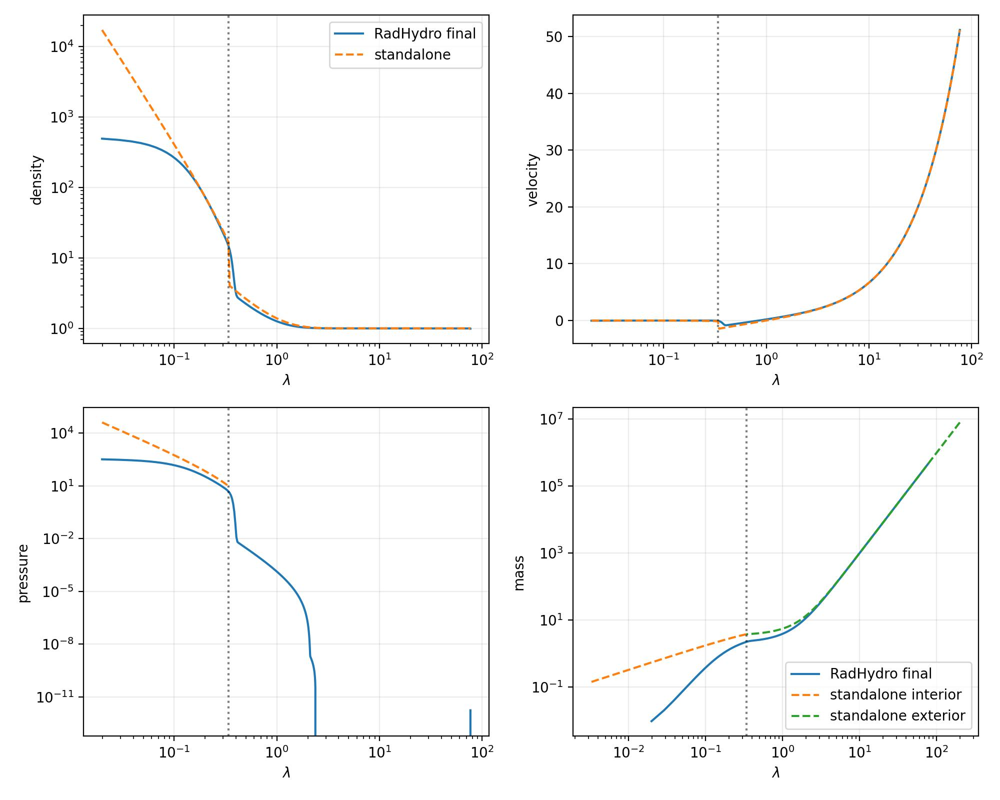
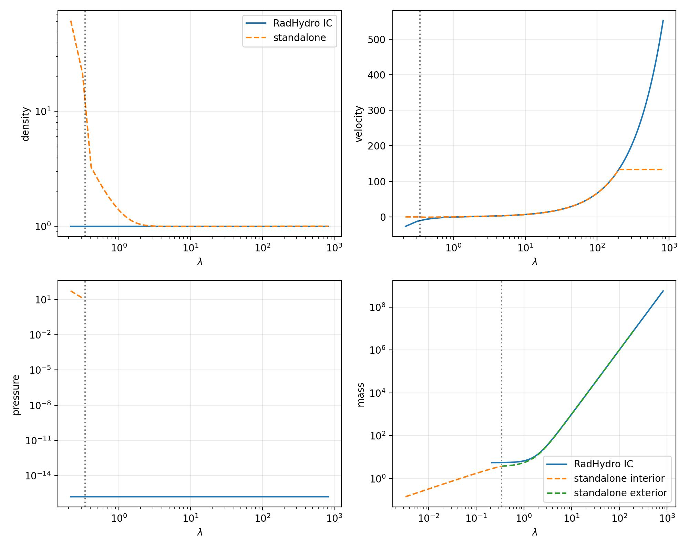
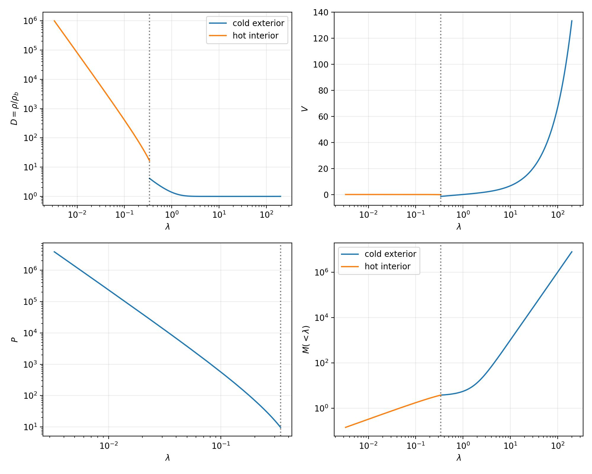

BertschingerGasReference
========================

``example/BertschingerGasReference`` is a standalone first stage for the
collisional-gas solution of Bertschinger (1985).  It intentionally does not
use RadHydropy or construct an initial-condition file.

Similarity equations
--------------------

For ``epsilon=1``, the turnaround radius scales as
``r_ta proportional to t^(8/9)``.  With

.. math::

   r=\lambda r_{\rm ta},\quad
   v=V r_{\rm ta}/t,\quad
   \rho=D\rho_b,\quad
   p=P\rho_b(r_{\rm ta}/t)^2,

the code solves the pressureless exterior separately, then integrates the
continuity, Euler, energy, and enclosed-mass equations inward in the shocked
region.  At ``lambda_s=0.339`` it applies the strong-shock
Rankine--Hugoniot conditions.

The shock position is selected by shooting on the inward solution's velocity
at a high-density central-asymptotic surface.  The resulting value is
``lambda_s=0.33897694`` at the default tolerance.  The plotted interior ends
at that asymptotic surface because its density diverges in the ideal
similarity solution.

Running
-------

.. code-block:: bash

   cd example/BertschingerGasReference
   python bertschinger_gas.py

This writes ``BertschingerGasReference.jpg``.

RadHydropy comparison
---------------------

The finite-volume comparison initializes ``Rsim`` with the cold scale-free
perturbation ``Delta M/M = A/r^3``, enables spherical gas self-gravity and
Einstein--de Sitter supercomoving expansion, and evolves to cosmic time
``t=4452.4``.  Its 800 kpc domain keeps the outer boundary outside
turnaround.
The final snapshot is rescaled into the same dimensionless ``D``, ``V``,
``P``, and ``M`` variables.

.. code-block:: bash

   cd example/BertschingerGasReference
   python bertschinger_gas_radhydropy_comparison.py

The run writes ``InitialCondition_RadHydro.hdf5``,
``Output_RadHydro_*.hdf5``, separate initial-condition and final comparison
figures, and an RMS-error report.
Since the analytic central solution has divergent density, the finite-volume
comparison is not expected to converge at the inner cutoff; the shock and
outer profile are the useful diagnostics at this stage.

   RadHydropy result (solid) compared with the standalone solution (dashed).

   Initial RadHydropy condition (solid) compared with the standalone solution.

Generated profiles
------------------

The figure contains the dimensionless density ``D``, velocity ``V``, pressure
``P``, and enclosed mass ``M`` as functions of ``lambda``.  The dotted
vertical line marks the fitted accretion shock position.

   Standalone Bertschinger gas similarity profiles.  The exterior is cold and
   pressureless; the interior is the shock-matched transonic gas branch.
