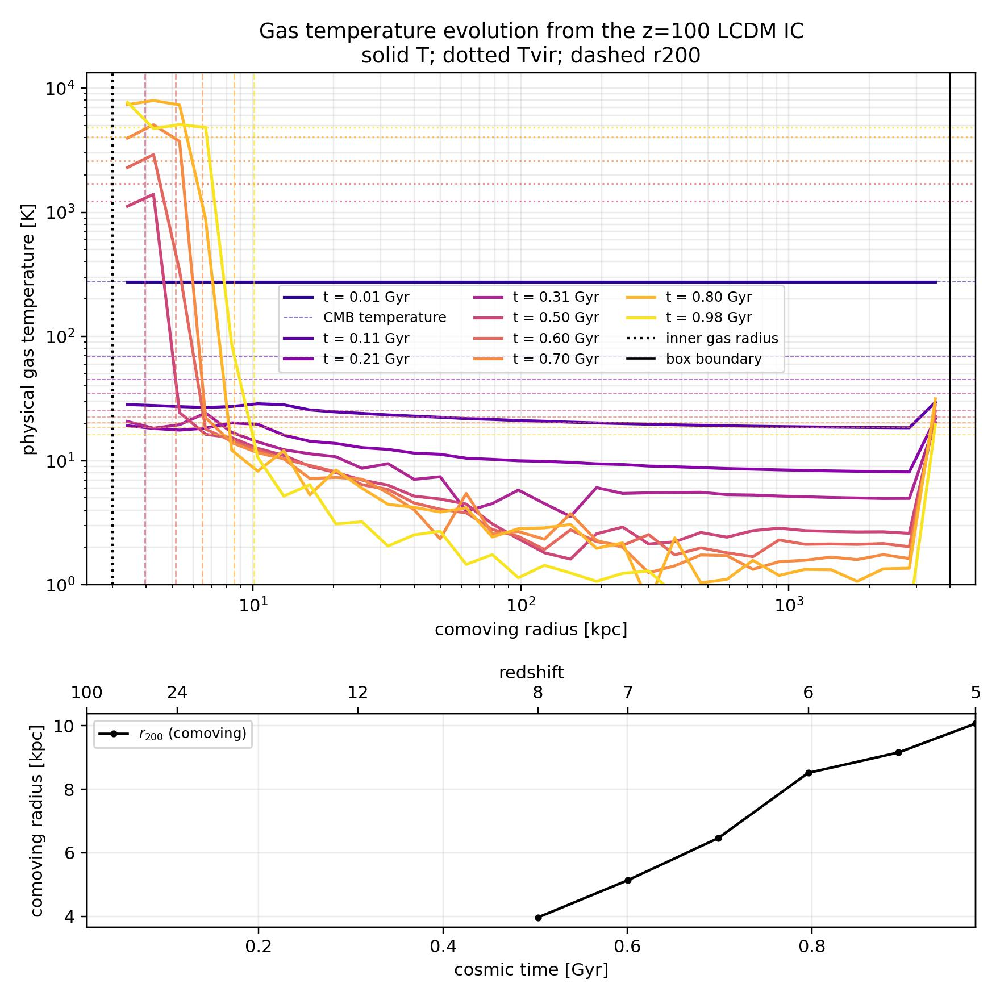
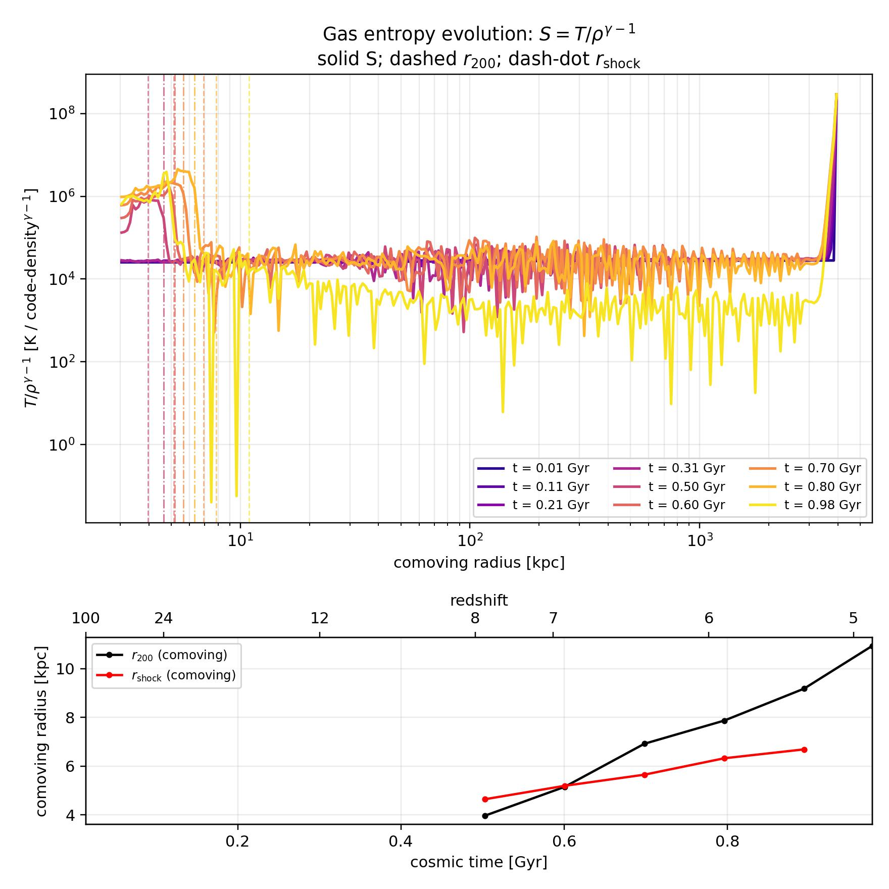
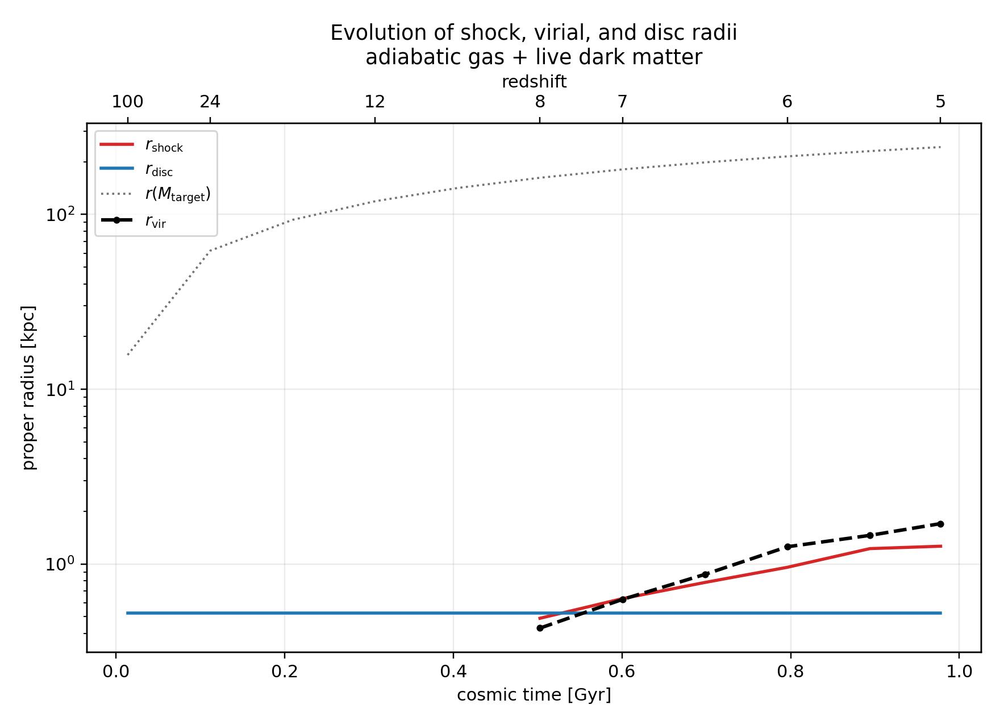

Cosmological Virial Shock 1D
============================

This example is a controlled spherical-collapse experiment based on the
cosmological virial-shock problem studied by Birnboim & Dekel.  It evolves
Eulerian gas cells together with live collisionless dark-matter shells in an
Einstein--de Sitter, supercomoving calculation.  The initial perturbation is
the correlation-function profile at ``z=100``; the gas and dark matter are
given the corresponding growing-mode velocity.

The example is useful for separating three questions:

* does the adiabatic calculation conserve the hydrodynamic and gravitational
  energy budget?
* does a shock form close to the evolving ``r_200`` radius?
* when thermochemistry is enabled, does cooling remove enough post-shock
  pressure to prevent a sustained hot halo?

The plots use comoving radius.  The outer one or two numerical cells are
excluded from the radial plots because the open/inflow outer boundary can
produce a nonphysical temperature and entropy response.

Initial-condition generation
-----------------------------

The correlation-function workflows use a generated linear-correlation HDF5
table before constructing the simulation initial condition. From the
repository root, generate the table if it is absent:

.. code-block:: python

   from tools.lcdm_correlation import generate_lcdm_correlation_table

   generate_lcdm_correlation_table(
       "example/CosmologicalVirialShock1D/outputs_correlation/"
       "lcdm_linear_correlation.h5"
   )

Then change into the example directory. The dark-matter-only generator writes
the correlation-shaped initial condition without evolving it:

.. code-block:: bash

   cd example/CosmologicalVirialShock1D
   python generate_cosmological_correlation_ic.py \
       --config cosmological_dark_matter_correlation_z100.yaml

This writes the configured ``InitialCondition.hdf5`` and
``CosmologicalCorrelationInitialCondition.jpg``. For the Lambda-CDM variant,
use ``generate_cosmological_correlation_ic_lambda_cdm.py`` with
``cosmological_dark_matter_correlation_z100_lambda_cdm.yaml``.

The gas-correlation runner constructs and writes its own gas-plus-dark-matter
initial condition before calling ``Rsim.RunAll()``. For example:

.. code-block:: bash

   python cosmological_gas_correlation_z100.py \
       --config cosmological_gas_correlation_z100.yaml

Do not run the gas runner until the configured correlation table exists. The
smoke and production gas configurations may also require the HM12 metal PIE
table referenced by ``par.thermochemistry.metal_pie_table_filename``.

Configuration index
--------------------

The directory contains several related YAML configurations. Use this table to
select the workflow rather than editing a production file in place. Commands
are shown from ``example/CosmologicalVirialShock1D``.

.. list-table:: CosmologicalVirialShock1D YAML configurations
   :header-rows: 1
   :widths: 34 27 26 24

   * - Configuration
     - Purpose
     - Runner
     - Main prerequisite/output
   * - ``cosmological_virial_shock1d_smoke.yaml``
     - Short end-to-end gas, dark-matter, and PIE smoke run.
     - ``cosmological_virial_shock1d.py``
     - Correlation table and HM12 metal PIE table; writes ``outputs_virial_shock_smoke``.
   * - ``cosmological_dark_matter_smoke.yaml``
     - Fast cosmology-only smoke run with an accelerated collapse and reduced shell count.
     - ``cosmological_dark_matter_only.py``
     - Correlation table only; writes ``outputs_correlation_smoke``.
   * - ``cosmological_dark_matter_correlation_z100.yaml``
     - EdS dark-matter correlation control at ``z=100``.
     - ``generate_cosmological_correlation_ic.py`` or ``cosmological_dark_matter_only.py``
     - Correlation table; writes under ``outputs_correlation``.
   * - ``cosmological_dark_matter_correlation_z100_lambda_cdm.yaml``
     - Lambda-CDM dark-matter correlation control.
     - ``generate_cosmological_correlation_ic_lambda_cdm.py`` or the Lambda-CDM DM runner.
     - LCDM correlation table; writes under ``outputs_correlation_lcdm``.
   * - ``cosmological_gas_correlation_z100.yaml``
     - Baseline EdS gas plus live dark matter with hydrogen sources.
     - ``cosmological_gas_correlation_z100.py``
     - Correlation table; writes under ``outputs_correlation_gas``.
   * - ``cosmological_gas_correlation_z100_adiabatic_256.yaml``
     - 256-cell adiabatic control for resolution comparison.
     - ``cosmological_gas_correlation_z100.py``
     - Correlation table; writes under ``outputs_correlation_gas_adiabatic_256``.
   * - ``cosmological_gas_correlation_z100_compton_atomic.yaml``
     - Hydrogen chemistry with atomic cooling and Compton coupling.
     - ``cosmological_gas_correlation_z100.py``
     - Correlation table; writes under ``outputs_correlation_gas_compton_atomic``.
   * - ``cosmological_gas_correlation_z100_atomic_only.yaml``
     - Atomic-cooling control without the combined Compton comparison.
     - ``cosmological_gas_correlation_z100.py``
     - Correlation table; writes under ``outputs_correlation_gas_compton_atomic_atomic_only``.
   * - ``cosmological_gas_correlation_z100_chemistry_no_thermal_coupling.yaml``
     - Chemistry control with thermal coupling disabled.
     - ``cosmological_gas_correlation_z100.py``
     - Correlation table; writes under ``outputs_correlation_gas_chemistry_no_thermal_coupling``.
   * - ``cosmological_gas_correlation_z100_compton_atomic_lambda_cdm.yaml``
     - Lambda-CDM Compton plus atomic comparison.
     - ``cosmological_gas_correlation_z100_lambda_cdm.py``
     - LCDM correlation table; writes under ``outputs_correlation_gas_compton_atomic_lcdm``.
   * - ``cosmological_gas_correlation_z100_lambda_cdm.yaml``
     - Lambda-CDM baseline gas-correlation run.
     - ``cosmological_gas_correlation_z100_lambda_cdm.py``
     - LCDM correlation table; writes under ``outputs_correlation_gas_lcdm``.
   * - ``cosmological_gas_correlation_z100_compton_atomic_m1e11.yaml``
     - Compton plus atomic run for the lower-mass halo control.
     - ``cosmological_gas_correlation_z100.py``
     - Correlation table; writes under ``outputs_correlation_gas_compton_atomic_m1e11``.
   * - ``cosmological_gas_correlation_z100_pie_z10_z01.yaml``
     - HM12 PIE cooling after the ``z=10`` UV-background transition.
     - ``cosmological_gas_correlation_z100.py``
     - Correlation and HM12 metal PIE tables; writes under ``outputs_correlation_gas_pie_z10_z01``.
   * - ``cosmological_gas_correlation_z100_pie_z10_m1e11_z0_z03.yaml``
     - Lower-mass HM12 PIE run with ``Z=0.03``.
     - ``cosmological_gas_correlation_z100.py``
     - Correlation and HM12 metal PIE tables; writes under ``outputs_correlation_gas_pie_z10_m1e11_z0_z03``.
   * - ``cosmological_gas_correlation_tvir1e3_z15.yaml``
     - Production ``T_vir=10^3 K``, ``z=15`` gas-correlation run.
     - ``cosmological_gas_correlation_z100.py``
     - Finite-box correlation table; writes under ``outputs_correlation_gas_tvir1e3_z15_gas1024``.
   * - ``cosmological_gas_dm_linear_growth.yaml``
     - Short EdS gas/dark-matter linear-growth diagnostic.
     - ``cosmological_gas_dm_linear_growth.py``
     - Correlation table; writes under ``outputs_linear_growth``.

The gas runner accepts any compatible gas YAML through ``--config``. Existing
output directories are configuration-specific so that adiabatic, cooling,
mass-control, and cosmology variants do not overwrite one another.

Adiabatic setup
---------------

The reference adiabatic run is configured by
``cosmological_gas_correlation_z100.yaml`` and writes to
``example/CosmologicalVirialShock1D/outputs_correlation_gas``.  Its important
settings are:

.. code-block:: yaml

   par:
     simulation:
       coordinate_system: spherical
     hydrodynamics:
       dual_energy: true
       dual_energy_eta1: 1.0e-3
       dual_energy_eta2: 1.0e-1
       dual_energy_entropy_limiter: false
       riemann_solver: Rusanov
       energy_diagnostics: true
     gravity:
       selfgravity: true
     cosmology:
       cosmological: true
       cosmological_expansion: true
       supercomoving_coordinates: true
       cosmology_type: einstein_de_sitter

The entropy limiter is deliberately disabled in this reference run.  It is
an experimental auxiliary-energy correction and can overestimate pressure in
strongly varying cells.  The conservative total energy remains authoritative;
the dual-energy field is used to obtain a positive, well-conditioned thermal
pressure when ``E-K`` suffers cancellation.

Run it from the repository's ``RadHydropy`` directory with:

.. code-block:: bash

   python example/CosmologicalVirialShock1D/cosmological_gas_correlation_z100.py \
       --config example/CosmologicalVirialShock1D/cosmological_gas_correlation_z100.yaml

The main adiabatic diagnostics are:

.. figure:: ../example/CosmologicalVirialShock1D/outputs_correlation_gas/CosmologicalGasCorrelationZ100_Temperatures.jpg
   :width: 100%
   :alt: Adiabatic gas temperature evolution

   Physical gas temperature versus comoving radius and time.

.. figure:: ../example/CosmologicalVirialShock1D/outputs_correlation_gas/CosmologicalGasCorrelationZ100_Entropy.jpg
   :width: 100%
   :alt: Adiabatic gas entropy evolution

   Entropy proxy ``S = T/rho**(gamma-1)``.  With the limiter disabled, the
   interior profile is not artificially raised by the auxiliary-energy
   correction; the entropy increase is associated with shock/compressive
   heating.

.. figure:: ../example/CosmologicalVirialShock1D/outputs_correlation_gas/CosmologicalGasCorrelationZ100_Radii.jpg
   :width: 100%
   :alt: Adiabatic virial and shock radii

   Evolving ``r_200`` and entropy-jump shock-radius diagnostics.

Energy diagnostics
~~~~~~~~~~~~~~~~~~

With ``par.hydrodynamics.energy_diagnostics: true``, RadHydropy records the
gas energy per cell
and the dark-matter energy per shell.  The audit also records gravitational
work, compression work, shock work, thermochemistry work, boundary exchange,
and dual-energy recovery events.  This makes a halo-only budget possible even
when cells cross the evolving halo boundary.

The run also produces ``CosmologicalGasCorrelationZ100_EnergyAudit.npz`` and
``CosmologicalGasCorrelationZ100_EnergyByCellAndShell.npz`` when energy
diagnostics are enabled. These generated audit files are not committed to the
repository; inspect them in the configured output directory after running the
workflow.

For an adiabatic run, the thermochemistry source term is zero.  A useful
global closure check is

.. math::

   E_{\rm closure} = E_{\rm gas}(t)-E_{\rm gas}(0)
       - W_{\rm gravity} - W_{\rm boundary}
       - \Delta E_{\rm background},

where the exact sign convention is stored in the audit metadata and helper
plots.  The dual-energy field does not inject energy unless both the
conservative and auxiliary thermal estimates are invalid; such floor events
are counted separately.

Thermochemistry comparison
--------------------------

The Compton + atomic-cooling case uses
``cosmological_gas_correlation_z100_compton_atomic.yaml``.  It enables
non-equilibrium hydrogen chemistry, atomic cooling, Compton coupling to the
CMB, and thermal coupling:

.. code-block:: yaml

   par:
     hydrodynamics:
       energy_diagnostics: true
       dual_energy_entropy_limiter: false
     thermochemistry:
       thermochemistry_network: hydrogen
       hydrogen_chemistry: true
       hydrogen_atomic_cooling: true
       hydrogen_recombination: true
       hydrogen_collisional_ionization: true
       hydrogen_thermal_coupling: true
       compton_cmb_enabled: true
       compton_cmb_redshift: 100.0

The current comparison output is in
``outputs_correlation_gas_compton_atomic``.  It was evolved
from ``z=100`` to ``t=0.9778`` Gyr, corresponding to approximately ``z=4.9``.
The canonical gas angular-momentum option is disabled by default; it is a
storage-only experiment and is not part of this spherical calculation.

   Temperature evolution with Compton coupling and primordial atomic cooling.

   Entropy evolution with the experimental entropy limiter disabled.

   Virial and entropy-jump shock-radius diagnostics.

The final halo in this particular realization is small:
``M_vir ~= 5.5e7 Msun`` and ``T_vir ~= 5.0e3 K``.  It therefore does not meet
the usual ``T_vir >= 1e4 K`` atomic-cooling threshold.  A transient region can
reach ``~1e4 K``, but it does not produce a stable, volume-filling hot halo.
This is a physical expectation for a low-mass, high-redshift collapse rather
than evidence that the entire cooling budget is being removed by Compton
cooling.

Birnboim--Dekel stability estimate
~~~~~~~~~~~~~~~~~~~~~~~~~~~~~~~~~~

For a monatomic gas, the local effective adiabatic index can be estimated as

.. math::

   \gamma_{\rm eff} = \gamma - \frac{q}{\dot{\rho}\,e},
   \qquad
   \gamma_{\rm crit}=\frac{10}{7}=1.4286,

with

.. math::

   t_{\rm cool}=\frac{e_{\rm th}}{|\dot e_{\rm thermo}|},
   \qquad
   t_{\rm comp}=\left|\frac{d\ln\rho}{dt}\right|^{-1}.

Here the saved ``q`` is the net thermochemical cooling rate per volume
(positive for cooling).  If ``q_spec=q/rho`` is used instead, the equivalent
form is ``gamma-rho*q_spec/(dot{rho}*e)``.  ``e`` is the specific internal
energy and ``dot{rho}`` is the local Lagrangian density rate.  This follows from
``P=(gamma-1) rho e`` and the energy equation
``dot{e}=P dot{rho}/rho**2-q``.  The commonly used
``gamma-t_comp/t_cool`` expression is a shorthand that is valid only when the
cooling and compression times are defined with these same local conventions.

The halo free-fall estimate is

.. math::

   t_{\rm ff}=\left(\frac{3\pi}{32G\bar\rho(<r)}\right)^{1/2}.

The runner now evaluates the source state and shock locator in the same
snapshot callback.  It saves per-cell ``q_cgs_erg_cm3_s``,
``rho_dot_cgs_g_cm3_s``, ``specific_energy_cgs_erg_g``, ``local_mach``, and
``gamma_eff``.  It also saves the corresponding scalar quantities prefixed
with ``shock_`` at the selected ``shock_cell_index``.  A value of ``-1`` and
``NaN`` shock scalars indicate that no valid shock was found.

At the strongest valid entropy-jump candidate in the regenerated
thermochemical run (``t=0.89390`` Gyr), the same-cell values are:

.. list-table::
   :header-rows: 1
   :widths: 55 25

   * - Quantity
     - Value
   * - Candidate shock cell
     - ``25``
   * - Candidate shock radius
     - ``0.9779`` proper kpc
   * - Gas temperature at candidate
     - ``1.049e3 K``
   * - Physical density
     - ``1.906e-26 g cm^-3``
   * - Net cooling rate ``q``
     - ``5.587e-35 erg cm^-3 s^-1``
   * - Density rate ``dot{rho}``
     - ``5.501e-41 g cm^-3 s^-1``
   * - Specific internal energy ``e``
     - ``1.300e11 erg g^-1``
   * - Local Mach number
     - ``4.36``
   * - Cooling time ``t_cool``
     - ``1.41e3 Gyr``
   * - Compression time ``t_comp``
     - ``0.01098 Gyr``
   * - ``gamma_eff``
     - ``1.66665885``
   * - ``gamma_crit``
     - ``1.429``

Thus ``gamma_eff > gamma_crit`` and this candidate is stable according to the
local Birnboim--Dekel diagnostic.  The earlier ``gamma_eff=0.979`` result was
caused by inconsistent density/unit conversion and cell/time sampling.  The
candidate is also not a robust ``10^4 K`` virial shock: the halo remains below
the atomic-cooling threshold and the selected feature is a moderate
compression transition.

There is, however, a distinct local instability in the dense ``10^4 K`` gas.
At the final saved snapshot (``t=0.97779`` Gyr), cell ``13`` has
``T=1.099e4 K``, ``q=7.516e-28 erg cm^-3 s^-1``,
``dot{rho}=3.960e-40 g cm^-3 s^-1``, and
``e=1.975e12 erg g^-1``.  These same-cell values give
``gamma_eff=0.706 < gamma_crit`` and ``t_cool=2.87 Myr``.  This demonstrates
that gas at the atomic-cooling temperature is locally unstable, but cell 13
is an inner dense cooling cell, not the identified virial-shock cell.  The
available halo therefore does not establish that its virial shock is
unstable; it establishes that the post-shock/inner gas can undergo rapid local
cooling.

The temperature-evolution figure also shows substantially less gas near
``10^3 K`` than the adiabatic calculation.  This is expected from the
nonlinear thermochemical response.  In the final 256-cell outputs, the
Compton+atomic run has only 15 cells with ``T >= 10^3 K`` and 2 with
``T >= 8e3 K``.  The matched 256-cell adiabatic run has 43 and 25 cells,
respectively.  The comparison is not caused by Compton cooling alone: the
atomic-only and Compton-only control runs retain about 40 cells above
``8e3 K``.  The combined run can first lower the temperature and pressure,
then increase compression and density; because the atomic terms scale roughly
as ``n_H^2`` while the thermal reservoir scales as ``rho e``, the local ratio
``q/(dot{rho} e)`` can grow rapidly.  Gas then passes through the ``10^4 K``
atomic-cooling regime and continues to much lower temperatures.  Once it has
cooled, its atomic rate decreases again, so the total integrated energy loss
can remain small even though the hot-gas fraction changes strongly.

The original ``outputs_correlation_gas`` adiabatic directory uses 128 gas
cells, whereas the aligned thermochemical output uses 256.  Therefore the
cell counts in the preceding paragraph use the dedicated 256-cell adiabatic
control.  The plotted curves are individual radial cells rather than a
mass-weighted temperature distribution; phase mass fractions are the preferred
quantity for a final hot-gas comparison.

Per-cell energy balance
~~~~~~~~~~~~~~~~~~~~~~~

The ``_energy_balance`` rerun records the exact hydrodynamic energy increment
applied to every Eulerian gas cell, in addition to cumulative gravity,
compression/shock work, and thermochemistry. Its generated file is
``CosmologicalGasCorrelationZ100_ComptonAtomic_energy_balance_EnergyByCellAndShell.npz``
in the configured ``_energy_balance`` output directory.
The cell-wise balance is

.. math::

   \Delta E_i = \Delta E_{i,\rm hydro} + W_{i,\rm grav}
       + \Delta E_{i,\rm thermo} + R_i,

where ``R_i`` is saved as ``gas_energy_balance_residual``.  For the physical
cells inside the final ``r_vir=1.70`` kpc, ``R_i`` is below ``6e-14`` code
energy per cell, so the bookkeeping closes.  The only large residual is the
outer boundary cell, where the global boundary-flux term is recorded in the
separate audit rather than assigned to one cell.

The final cumulative thermochemical change is ``-3.873`` code-energy units
over all cells, but only ``-4.18e-3`` inside ``r_vir``.  The largest losses are
in outer cells ``254``--``252`` at proper radii ``648``, ``630``, and ``613``
kpc, with losses ``-2.52``, ``-0.969``, and ``-0.209`` code-energy units.
Their final temperatures are approximately ``457``, ``73``, and ``5.7`` K.
Thus the dominant recorded radiative loss occurs in the outer inflow/reservoir,
not in the virialized halo.  Inside the halo, the much lower thermal content is
primarily associated with changed hydrodynamic transport, compression, and
gravitational evolution; it is not explained by a large cumulative cooling
sink there.  This is also why a small global thermochemistry energy change can
coexist with a strongly reduced hot-gas fraction.

The aperture-summed time evolution inside ``2 r_vir(t)`` is plotted in the
generated ``CosmologicalGasCorrelationZ100_ComptonAtomic_energy_balance_2RvirEnergyBalance_TimeEvolution.jpg``
file in that output directory.
The upper horizontal axis gives the corresponding redshift.  The same
redshift axis is now included on the time-history panels of the density,
temperature, entropy, mass, radius, and energy-balance figures in the
``_energy_balance`` output directory.
At the final snapshot, the aperture contains 68 Eulerian cells and the
components are ``Delta E=6.13e-3``, hydro ``2.53e-3``, gravitational work
``7.77e-3``, and thermochemistry ``-4.18e-3`` code-energy units.  Their sum
matches ``Delta E``; the residual is ``-3.8e-18``.  The figure shows aperture
sums, while the generated ``EnergyByCellAndShell.npz`` retains the individual
cell histories.

The hydrogen source implementation was independently evaluated using the
analytic atomic and Compton expressions.  The atomic-only and combined source
rates agree with the implementation to better than ``3e-15`` relative error.
For this calculation, ``q`` must mean the net cooling rate, including Compton
cooling, and must use the evolved residual electron fraction rather than a
CIE substitute.  The source sign is ``q = -thermal_rate`` because the code's
thermal source is positive for heating.

The source-aware audit writes an aligned output, energy audit, and cell/shell
history NPZ file in its configured output directory. These generated audit
files are intentionally not linked here because they are not committed
artifacts.

The thermochemistry run closes the conservative energy audit to roundoff when
the recorded thermochemical source term is included.  Thermochemistry changes
the gas energy physically, so gas energy alone is not expected to be constant;
the source work must be included in the total budget.

References
----------

* Birnboim & Dekel, *Virial shocks in galactic haloes?*,
  `arXiv:astro-ph/0302161 <https://arxiv.org/abs/astro-ph/0302161>`_.
* Birnboim & Dekel, *Virial shocks in galactic haloes?*,
  `MNRAS 345, 349 <https://academic.oup.com/mnras/article/345/1/349/984798>`_.
* Kereš et al., *Galaxies in a simulated Lambda-CDM Universe I: cold mode and
  hot cores*, `arXiv:0809.1430 <https://arxiv.org/abs/0809.1430>`_.

Source files
------------

* :download:`runner <../example/CosmologicalVirialShock1D/cosmological_gas_correlation_z100.py>`
* :download:`adiabatic configuration <../example/CosmologicalVirialShock1D/cosmological_gas_correlation_z100.yaml>`
* :download:`Compton + atomic configuration <../example/CosmologicalVirialShock1D/cosmological_gas_correlation_z100_compton_atomic.yaml>`
