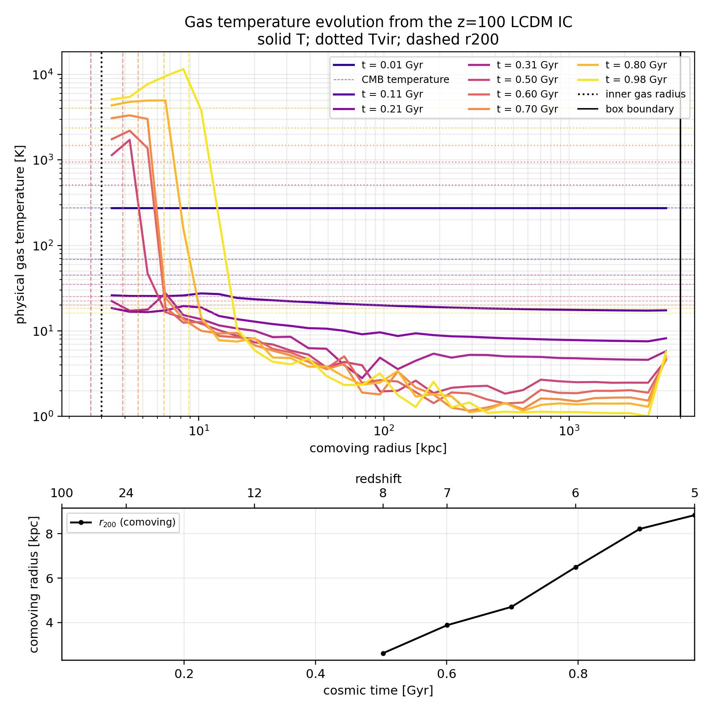
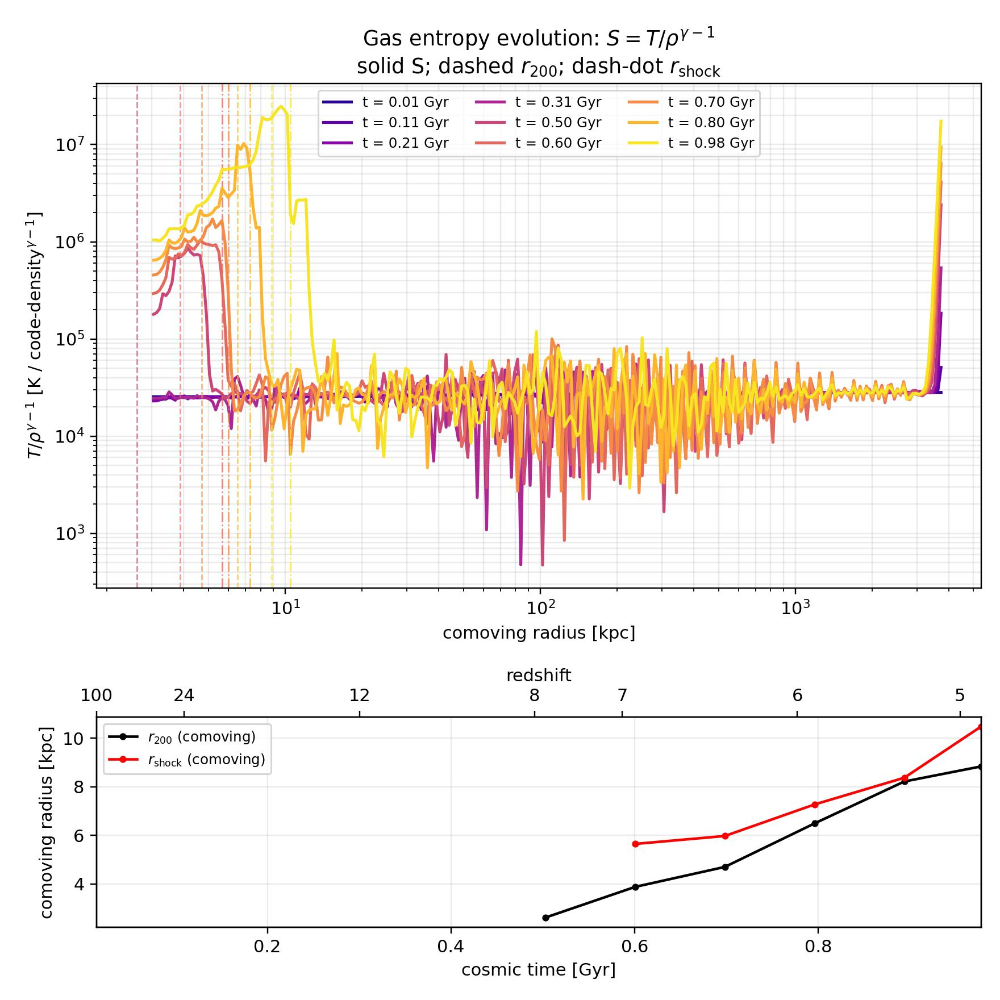
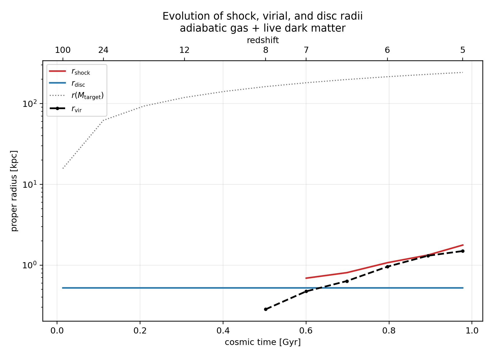
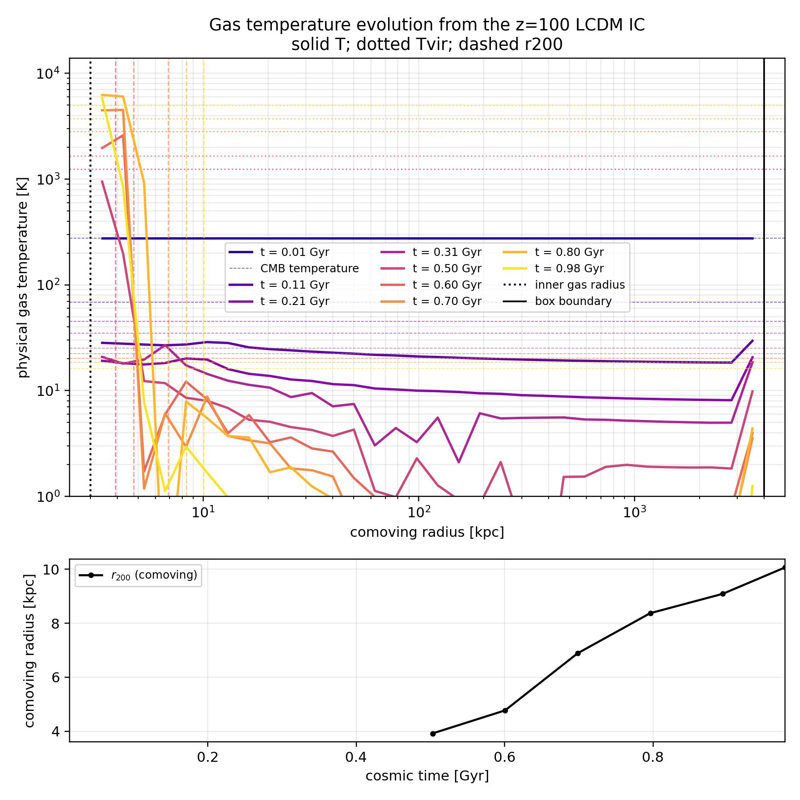
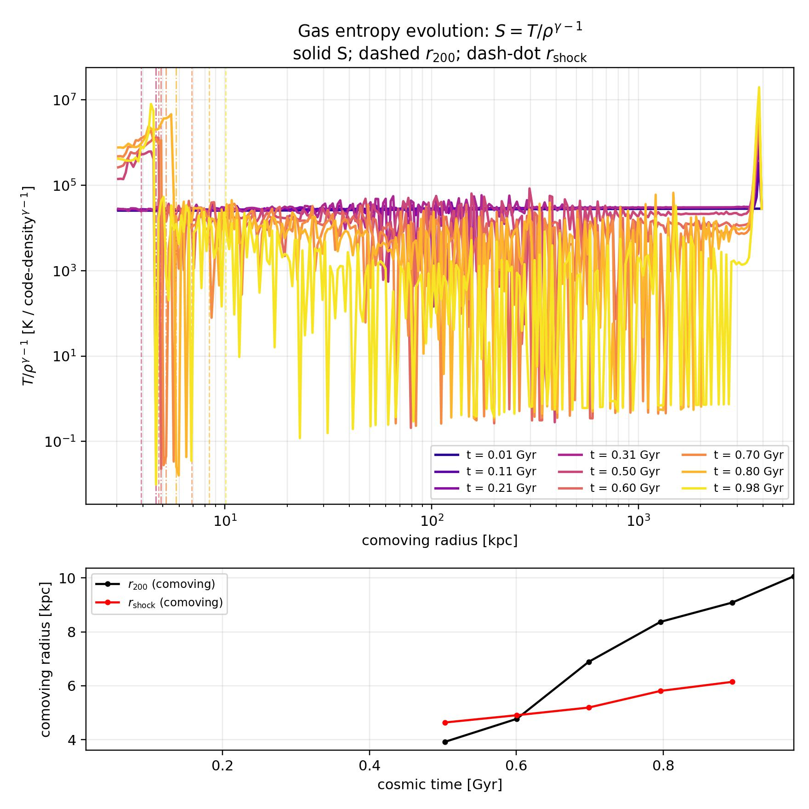
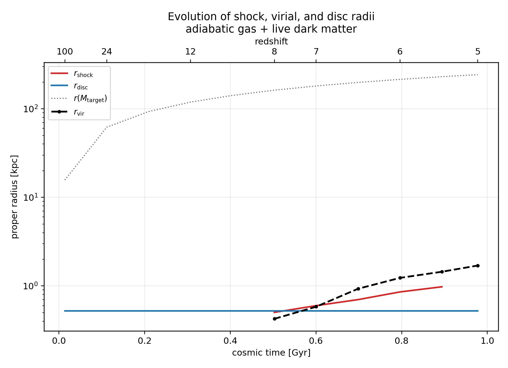

Cosmological Virial Shock 1D
============================

This example is a controlled spherical-collapse experiment based on the
cosmological virial-shock problem studied by Birnboim & Dekel.  It evolves
Eulerian gas cells together with live collisionless dark-matter shells in an
Einstein--de Sitter, supercomoving calculation.  The initial perturbation is
the correlation-function profile at ``z=100``; the gas and dark matter are
given the corresponding growing-mode velocity.

The example is useful for separating three questions:

* does the adiabatic calculation conserve the hydrodynamic and gravitational
  energy budget?
* does a shock form close to the evolving ``r_200`` radius?
* when thermochemistry is enabled, does cooling remove enough post-shock
  pressure to prevent a sustained hot halo?

The plots use comoving radius.  The outer one or two numerical cells are
excluded from the radial plots because the open/inflow outer boundary can
produce a nonphysical temperature and entropy response.

Adiabatic setup
---------------

The reference adiabatic run is configured by
``cosmological_gas_correlation_z100.yaml`` and writes to
``example/CosmologicalVirialShock1D/outputs_correlation_gas``.  Its important
settings are:

.. code-block:: yaml

   coordsys: spherical
   cosmology_type: einstein_de_sitter
   cosmological_expansion: true
   supercomoving_coordinates: true
   selfgravity: true
   dual_energy: true
   dual_energy_eta1: 1.0e-3
   dual_energy_eta2: 1.0e-1
   dual_energy_entropy_limiter: false
   riemann_solver: Rusanov
   energy_diagnostics: true

The entropy limiter is deliberately disabled in this reference run.  It is
an experimental auxiliary-energy correction and can overestimate pressure in
strongly varying cells.  The conservative total energy remains authoritative;
the dual-energy field is used to obtain a positive, well-conditioned thermal
pressure when ``E-K`` suffers cancellation.

Run it from the repository's ``RadHydropy`` directory with:

.. code-block:: bash

   python example/CosmologicalVirialShock1D/cosmological_gas_correlation_z100.py \
       --config example/CosmologicalVirialShock1D/cosmological_gas_correlation_z100.yaml

The main adiabatic diagnostics are:

   Physical gas temperature versus comoving radius and time.

   Entropy proxy ``S = T/rho**(gamma-1)``.  With the limiter disabled, the
   interior profile is not artificially raised by the auxiliary-energy
   correction; the entropy increase is associated with shock/compressive
   heating.

   Evolving ``r_200`` and entropy-jump shock-radius diagnostics.

Energy diagnostics
~~~~~~~~~~~~~~~~~~

With ``energy_diagnostics: true``, RadHydropy records the gas energy per cell
and the dark-matter energy per shell.  The audit also records gravitational
work, compression work, shock work, thermochemistry work, boundary exchange,
and dual-energy recovery events.  This makes a halo-only budget possible even
when cells cross the evolving halo boundary.

The saved files are:

* :download:`energy audit <../example/CosmologicalVirialShock1D/outputs_correlation_gas/CosmologicalGasCorrelationZ100_EnergyAudit.npz>`
* :download:`cell and shell history <../example/CosmologicalVirialShock1D/outputs_correlation_gas/CosmologicalGasCorrelationZ100_EnergyByCellAndShell.npz>`

For an adiabatic run, the thermochemistry source term is zero.  A useful
global closure check is

.. math::

   E_{\rm closure} = E_{\rm gas}(t)-E_{\rm gas}(0)
       - W_{\rm gravity} - W_{\rm boundary}
       - \Delta E_{\rm background},

where the exact sign convention is stored in the audit metadata and helper
plots.  The dual-energy field does not inject energy unless both the
conservative and auxiliary thermal estimates are invalid; such floor events
are counted separately.

Thermochemistry comparison
--------------------------

The Compton + atomic-cooling case uses
``cosmological_gas_correlation_z100_compton_atomic.yaml``.  It enables
non-equilibrium hydrogen chemistry, atomic cooling, Compton coupling to the
CMB, and thermal coupling:

.. code-block:: yaml

   thermochemistry_network: hydrogen
   hydrogen_chemistry: true
   hydrogen_atomic_cooling: true
   hydrogen_recombination: true
   hydrogen_collisional_ionization: true
   hydrogen_thermal_coupling: true
   compton_cmb_enabled: true
   compton_cmb_redshift: 100.0
   energy_diagnostics: true
   dual_energy_entropy_limiter: false

The current comparison output is in
``outputs_correlation_gas_compton_atomic_thermochem_entropy_limiter_off``.
It was evolved from ``z=100`` to ``t=0.9778`` Gyr, corresponding to
approximately ``z=4.9``.

   Temperature evolution with Compton coupling and primordial atomic cooling.

   Entropy evolution with the experimental entropy limiter disabled.

   Virial and entropy-jump shock-radius diagnostics.

The final halo in this particular realization is small:
``M_vir ~= 5.5e7 Msun`` and ``T_vir ~= 5.0e3 K``.  It therefore does not meet
the usual ``T_vir >= 1e4 K`` atomic-cooling threshold.  A transient region can
reach ``~1e4 K``, but it does not produce a stable, volume-filling hot halo.
This is a physical expectation for a low-mass, high-redshift collapse rather
than evidence that the entire cooling budget is being removed by Compton
cooling.

Birnboim--Dekel stability estimate
~~~~~~~~~~~~~~~~~~~~~~~~~~~~~~~~~~

For a monatomic gas, the local effective adiabatic index can be estimated as

.. math::

   \gamma_{\rm eff} = \gamma - \frac{t_{\rm comp}}{t_{\rm cool}},
   \qquad
   \gamma_{\rm crit}=\frac{10}{7}=1.4286,

with

.. math::

   t_{\rm cool}=\frac{e_{\rm th}}{|\dot e_{\rm thermo}|},
   \qquad
   t_{\rm comp}=\left|\frac{d\ln\rho}{dt}\right|^{-1}.

The halo free-fall estimate is

.. math::

   t_{\rm ff}=\left(\frac{3\pi}{32G\bar\rho(<r)}\right)^{1/2}.

At the strongest entropy-jump candidate in the thermochemical run
(``t=0.894`` Gyr), the approximate values are:

.. list-table::
   :header-rows: 1
   :widths: 55 25

   * - Quantity
     - Value
   * - Candidate shock radius
     - ``0.978`` proper kpc
   * - Gas temperature at candidate
     - ``1.05e3 K``
   * - Cooling time ``t_cool``
     - ``0.586 Gyr``
   * - Compression time ``t_comp``
     - ``0.403 Gyr``
   * - Free-fall time ``t_ff``
     - ``0.0795 Gyr``
   * - ``t_cool/t_ff``
     - ``7.37``
   * - ``gamma_eff``
     - ``0.979``
   * - ``gamma_crit``
     - ``1.429``

Thus ``gamma_eff < gamma_crit`` and the candidate shock is unstable according
to the Birnboim--Dekel criterion.  The fact that ``t_cool`` is longer than
``t_ff`` does not by itself establish shock stability: the criterion compares
cooling with the post-shock compression time, not only with the halo free-fall
time.  Cells at the configured temperature floor must be excluded from this
estimate because their inferred cooling time is dominated by the floor rather
than by the physical cooling rate.

The source-aware audit is:

* :download:`energy audit <../example/CosmologicalVirialShock1D/outputs_correlation_gas_compton_atomic_thermochem_entropy_limiter_off/CosmologicalGasCorrelationZ100_ComptonAtomic_thermochem_entropy_limiter_off_EnergyAudit.npz>`
* :download:`cell and shell history <../example/CosmologicalVirialShock1D/outputs_correlation_gas_compton_atomic_thermochem_entropy_limiter_off/CosmologicalGasCorrelationZ100_ComptonAtomic_thermochem_entropy_limiter_off_EnergyByCellAndShell.npz>`

The thermochemistry run closes the conservative energy audit to roundoff when
the recorded thermochemical source term is included.  Thermochemistry changes
the gas energy physically, so gas energy alone is not expected to be constant;
the source work must be included in the total budget.

References
----------

* Birnboim & Dekel, *Virial shocks in galactic haloes?*,
  `arXiv:astro-ph/0302161 <https://arxiv.org/abs/astro-ph/0302161>`_.
* Birnboim & Dekel, *Virial shocks in galactic haloes?*,
  `MNRAS 345, 349 <https://academic.oup.com/mnras/article/345/1/349/984798>`_.
* Kereš et al., *Galaxies in a simulated Lambda-CDM Universe I: cold mode and
  hot cores*, `arXiv:0809.1430 <https://arxiv.org/abs/0809.1430>`_.

Source files
------------

* :download:`runner <../example/CosmologicalVirialShock1D/cosmological_gas_correlation_z100.py>`
* :download:`adiabatic configuration <../example/CosmologicalVirialShock1D/cosmological_gas_correlation_z100.yaml>`
* :download:`Compton + atomic configuration <../example/CosmologicalVirialShock1D/cosmological_gas_correlation_z100_compton_atomic.yaml>`
