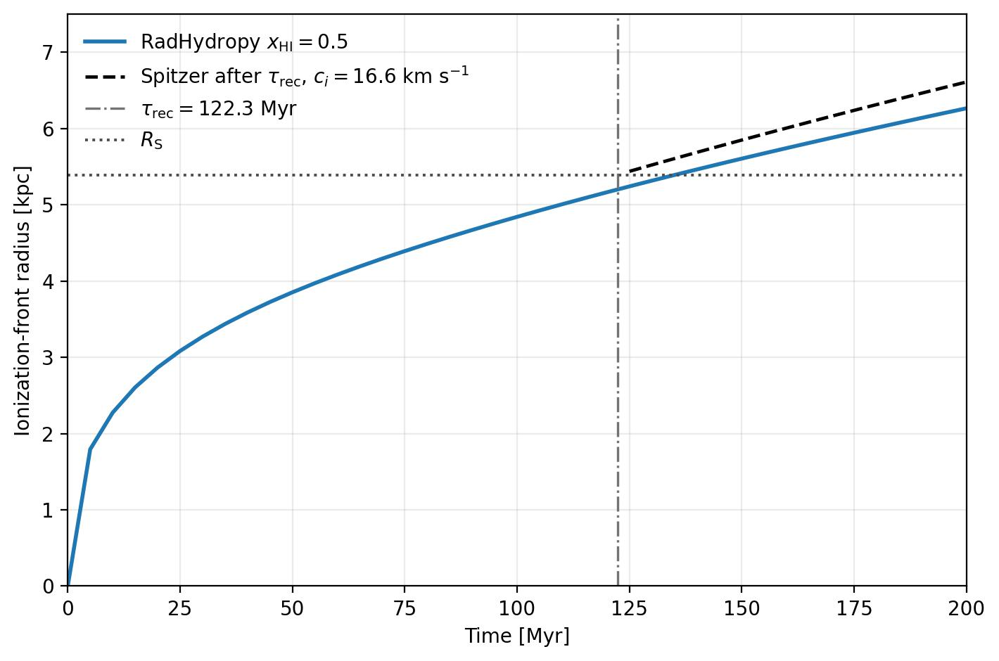
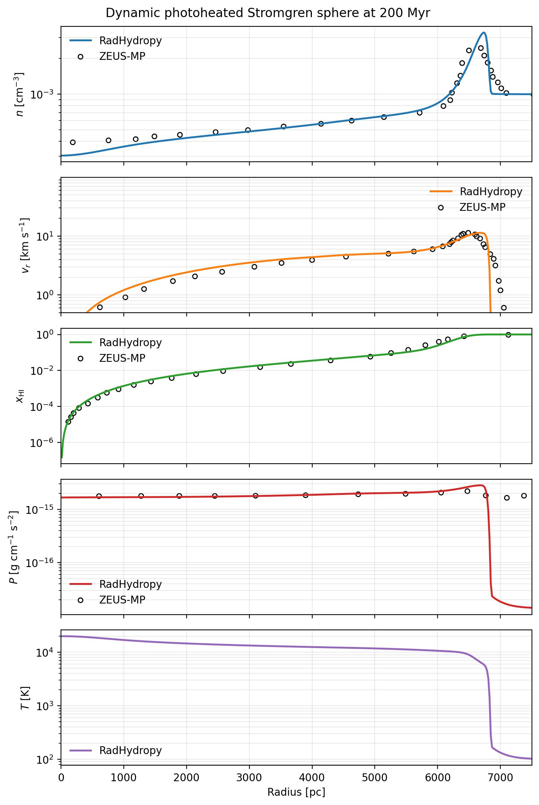

Dynamic Stromgren Sphere Photoheating 1D
========================================

The ``example/DynamicStromgrenSpherePhotoheating1D`` case evolves a Stromgren
sphere with photoheating in time while comparing the result against tabulated
reference profiles. This example is useful for checking that the code captures
both the radiative transfer and the thermal response consistently during the
expansion.

   Call sequence for ``RunAll()`` in the dynamic photoheating example.

.. figure:: ../example/DynamicStromgrenSpherePhotoheating1D/DynamicStromgrenSpherePhotoheating1D_IFront.jpg
   :width: 100%
   :alt: Dynamic Stromgren sphere ionization-front comparison

   Ionization-front evolution for the dynamic photoheating benchmark.

.. figure:: ../example/DynamicStromgrenSpherePhotoheating1D/DynamicStromgrenSpherePhotoheating1D.jpg
   :width: 100%
   :alt: Dynamic Stromgren sphere radial profiles

   Radial profile comparison for the dynamic photoheating benchmark.

C²-Ray variant
--------------

The same dynamic photoheating problem can be run with the causal C²-Ray
temporal update:

.. code-block:: bash

   cd example/DynamicStromgrenSpherePhotoheating1D
   python dynamic_stromgren_sphere_photoheating1d.py \
      --config dynamic_stromgren_sphere_photoheating1d_c2ray.yaml

The C²-Ray configuration keeps the original 1024-cell mesh, 200 Myr runtime,
hydrodynamic expansion, temperature-dependent photoheating response, and
tabulated reference profiles. It uses the existing ``output_times.txt``
schedule but writes separate ``InitialCondition_C2Ray.hdf5`` and
``Output_C2Ray_*.hdf5`` files. The generated figures are:

   Ionization-front evolution using C²-Ray.

   Final radial density, velocity, thermal, and ionization profiles using
   C²-Ray.
