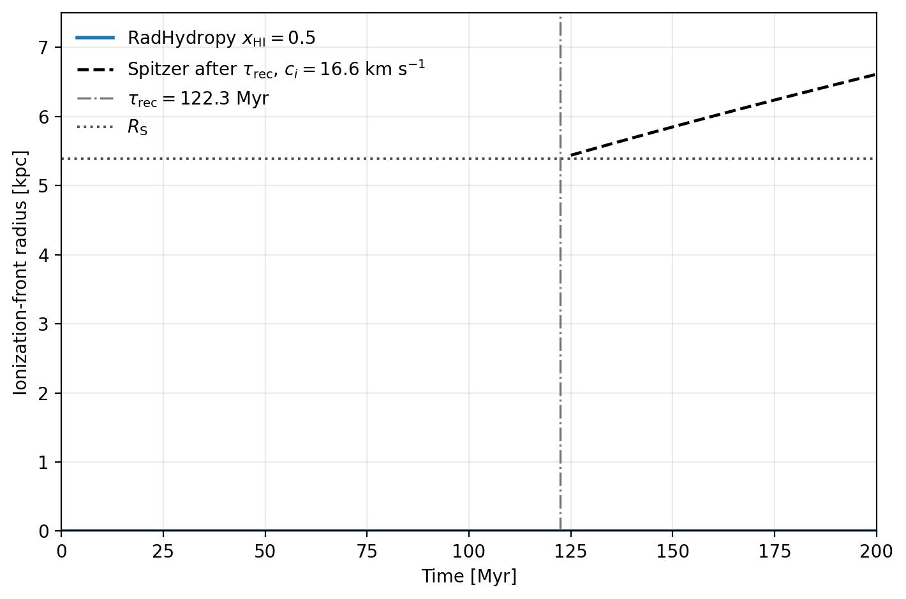
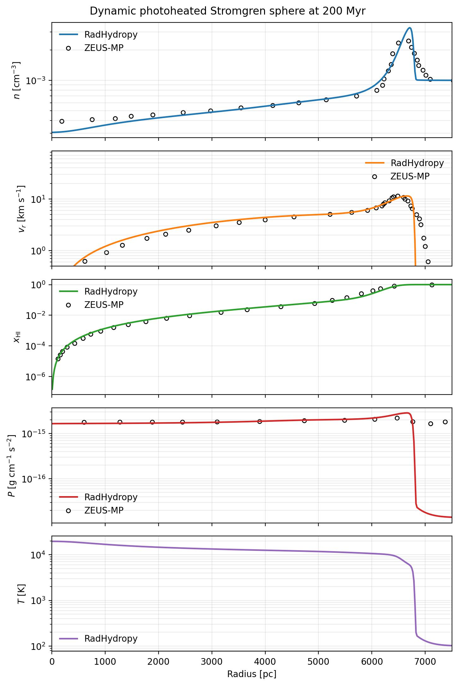

Dynamic Stromgren Sphere Photoheating 1D
========================================

The ``example/DynamicStromgrenSpherePhotoheating1D`` case evolves a Stromgren
sphere with photoheating in time while comparing the result against tabulated
reference profiles. This example is useful for checking that the code captures
both the radiative transfer and the thermal response consistently during the
expansion.

   Ionization-front evolution for the dynamic photoheating benchmark.

   Radial profile comparison for the dynamic photoheating benchmark.
