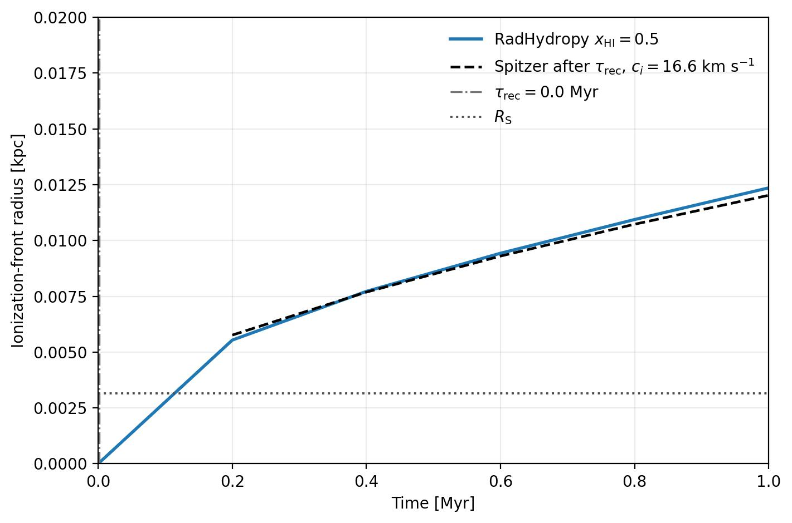
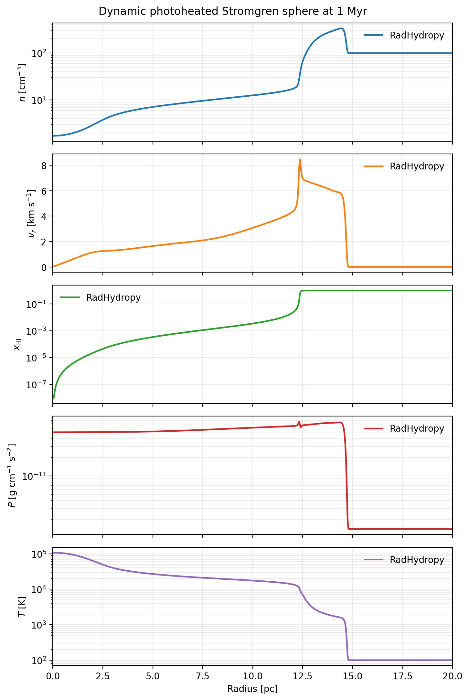
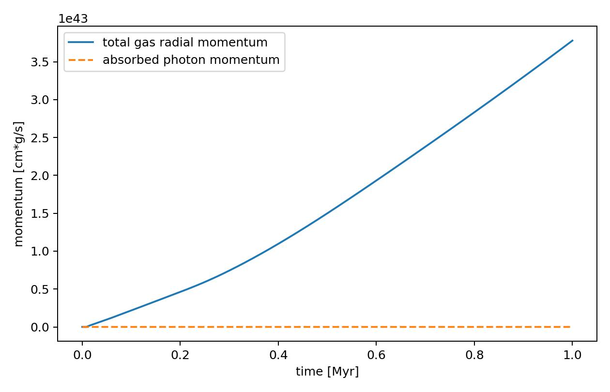
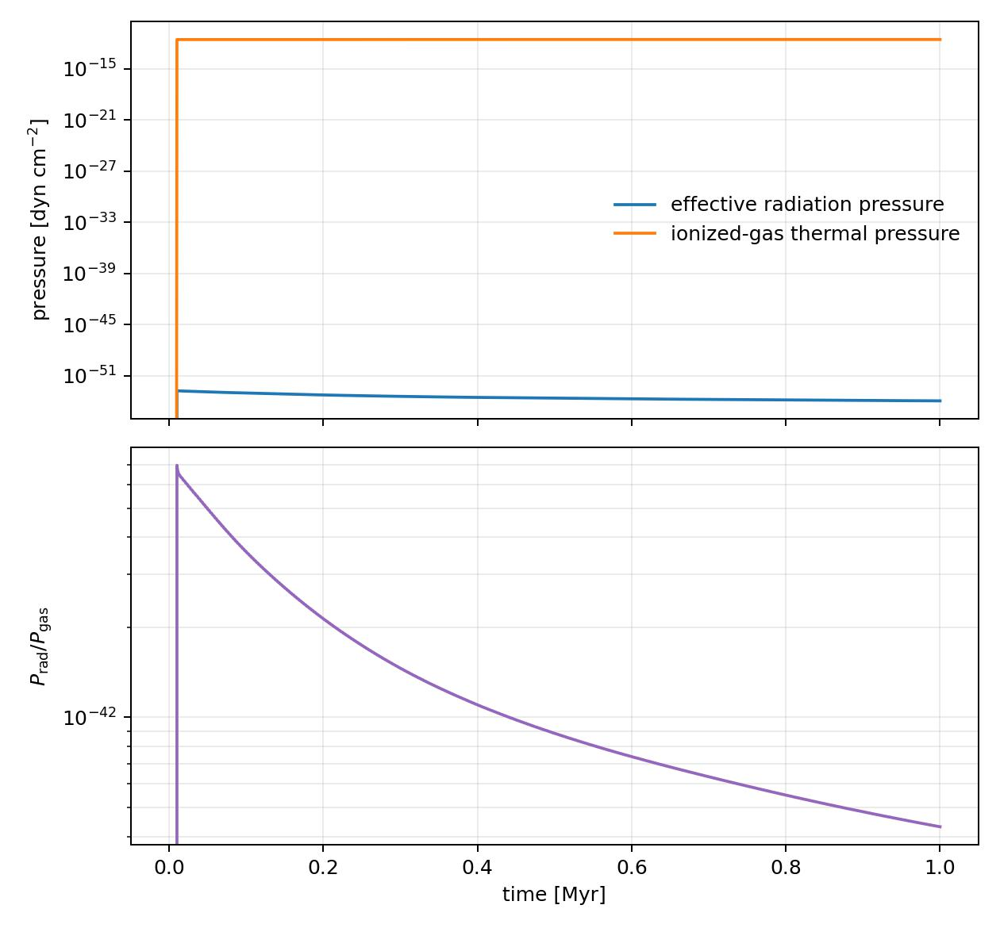
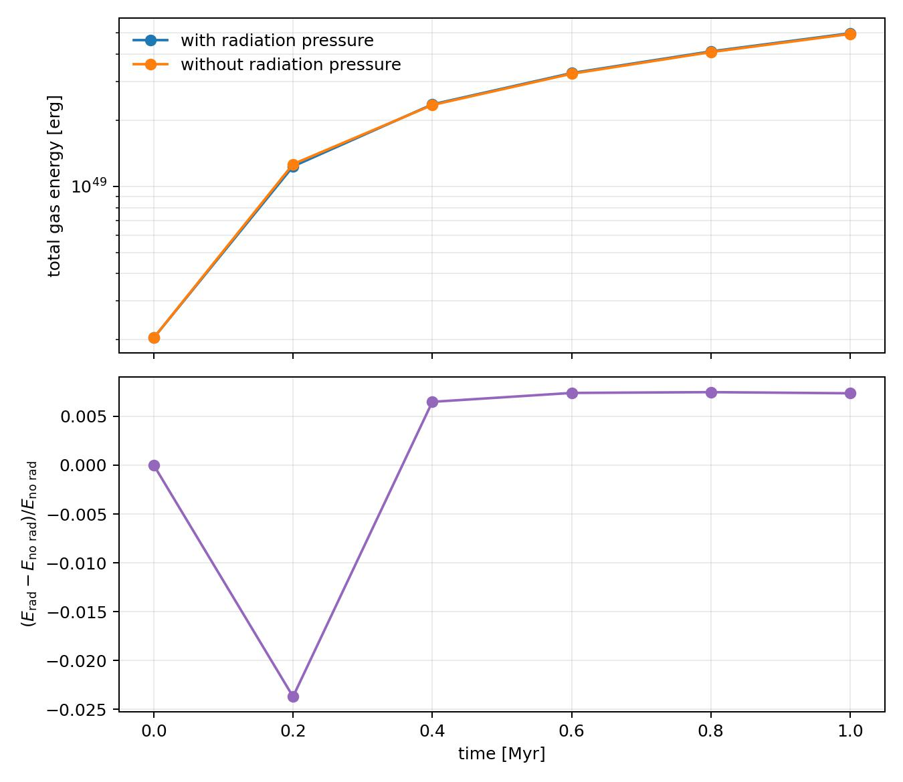

Dynamic Strömgren Sphere Photoheating with Radiation Pressure 1D
=================================================================

The ``example/DynamicStromgrenSpherePhotoheating20pcRadiationPressure1D``
example evolves a photoheated, expanding H II region while transferring the
momentum of absorbed ionizing photons to the gas. It is a 20 pc spherical
calculation with 512 cells, an initial hydrogen density of
``100 cm^-3``, a source rate of ``10^49 s^-1``, and a runtime of 1 Myr.

The run enables both long-characteristic radiative transfer and direct
radiation pressure:

.. code-block:: yaml

   radiative_transfer: true
   radiation_pressure: true
   radiation_pressure_efficiency: 1.0

Thermo-chemistry calculates the absorbed photon rate. The radiation-pressure
source then converts the absorbed photon energy into momentum and applies it
to the gas after the thermo-chemistry update.

Running the example
-------------------

Run the example from its directory:

.. code-block:: console

   $ cd example/DynamicStromgrenSpherePhotoheating20pcRadiationPressure1D
   $ python dynamic_stromgren_sphere_photoheating20pc_radiation_pressure1d.py

The script writes the initial condition, numbered ``Output_RadiationPressure``
snapshots, radial profiles, and the figures shown below. To compare the total
gas energy against the otherwise identical run without radiation pressure,
first ensure that both example directories contain snapshots at matching
times, then run:

.. code-block:: console

   $ python compare_total_gas_energy.py

The comparison includes thermal and kinetic gas energy and plots the relative
difference from the no-radiation-pressure run.

Ionization-front evolution
---------------------------

The ionization-front diagnostic compares the simulated front with the
classical Strömgren radius, the recombination-time marker, and the
post-recombination Spitzer expansion estimate.

   Ionization-front radius as a function of time.

Final radial structure
----------------------

The final profile figure shows the density, radial velocity, neutral fraction,
pressure, and temperature structure. The velocity panel uses a linear scale
to show both the inner and outer gas motion.

   Final radial profiles at 1 Myr.

Momentum budget
---------------

This figure compares the total gas radial momentum with the cumulative
momentum carried by absorbed photons:

.. math::

   p_{\rm rad}(t) = \int_0^t \frac{L_{\rm abs}(t')}{c}\,dt'.

The two curves do not have to agree exactly in the full hydrodynamic example:
gas pressure, hydrodynamic fluxes, spherical geometry, and changes in the
moving gas distribution also affect the scalar radial-momentum diagnostic.

   Total gas radial momentum compared with the absorbed-photon momentum.

Pressure comparison
-------------------

The pressure diagnostic estimates the effective radiation pressure at the
ionization front and the volume-weighted thermal pressure of the ionized gas.
The lower panel shows their ratio,

.. math::

   P_{\rm rad}/P_{\rm gas}.

   Effective radiation pressure, ionized-gas thermal pressure, and their ratio.

Energy comparison
------------------

The total-energy comparison isolates the dynamical effect of radiation
pressure by comparing simulations with and without the radiation-pressure
source at the same snapshot times. The total gas energy is

.. math::

   E_{\rm gas}=E_{\rm thermal}+E_{\rm kinetic}.

   Total thermal-plus-kinetic gas energy and its relative difference from the
   photoheating-only run.

Output data
-----------

The run also writes:

* ``radial_profile_rhd.csv`` for the final radial state;
* ``DynamicStromgrenSpherePhotoheating20pcRadiationPressure1D_PressureRatio.csv``
  for the pressure diagnostic; and
* ``DynamicStromgrenSpherePhotoheating20pcRadiationPressure1D_TotalGasEnergy.csv``
  for the matched-time energy comparison.

For the underlying momentum-deposition equations and the isolated
source-conservation test, see :doc:`radiation_pressure`.

