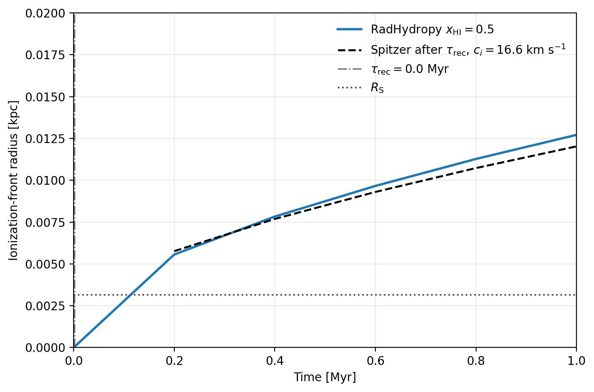
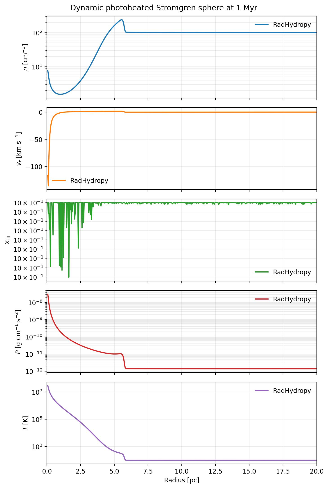

Dynamic Stromgren Sphere Photoheating with Stellar Wind 1D
===========================================================

The ``example/DynamicStromgrenSpherePhotoheating20pcStellarWind1D`` case
evolves a dense, photoheated Stromgren sphere with a central stellar wind.
It uses a 20 pc spherical domain with 512 cells, an ambient hydrogen density
of 100 cm^-3, an ionizing photon rate of ``10^49`` s^-1, and a runtime of
1 Myr.

The inner spherical boundary injects a wind with:

* mass-loss rate ``10^-6`` M_sun yr^-1;
* velocity 1000 km s^-1;
* temperature 100 K; and
* mean molecular weight ``mu = 0.62``.

The wind density is derived from the requested mass flux at the injection
radius ``rinj = 0.05`` pc. The radial-profile figure contains density,
radial velocity, neutral fraction, pressure, and temperature panels. Radius
is shown in pc and radial velocity uses a logarithmic scale with a lower limit
of 0.5 km s^-1.

Example figures
---------------

The ionization-front figure shows the front radius as a function of time. It
also shows the classical Stromgren radius, the recombination-time marker, and
the post-recombination Spitzer expansion estimate for comparison. The Spitzer
curve uses the ionized-gas sound speed at ``10^4 K`` (about 16.6 km s^-1 for
``gamma = 5/3`` and ``mu = 0.5``). The central wind changes the gas dynamics
while the photon source controls the ionization front.

   Ionization-front evolution for the photoheated Stromgren sphere with a
   central stellar wind. The solid curve is the RadHydropy neutral-fraction
   front; the reference lines show the Stromgren and Spitzer estimates.

   Final radial profiles at 1 Myr. From top to bottom, the panels show hydrogen
   number density, radial velocity, neutral hydrogen fraction, pressure, and
   gas temperature. The wind-driven inner cavity and the photoionized shell
   are visible in the density, velocity, pressure, and temperature structure.

Run the example from its directory:

.. code-block:: bash

   cd example/DynamicStromgrenSpherePhotoheating20pcStellarWind1D
   python dynamic_stromgren_sphere_photoheating20pc_stellar_wind1d.py

To convert all HDF5 snapshots into time-stamped radial-profile CSV files:

.. code-block:: bash

   python write_snapshot_radial_profiles.py

The CSV files are written to ``radial_profiles/`` with names such as
``radial_profile_0.2Myr.csv``.
