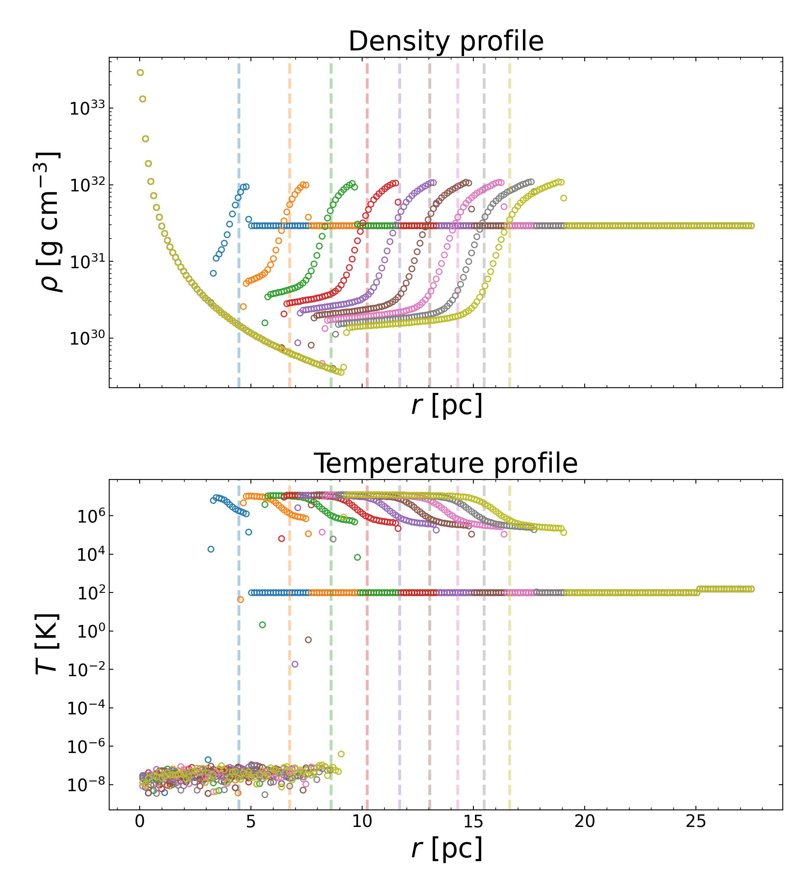
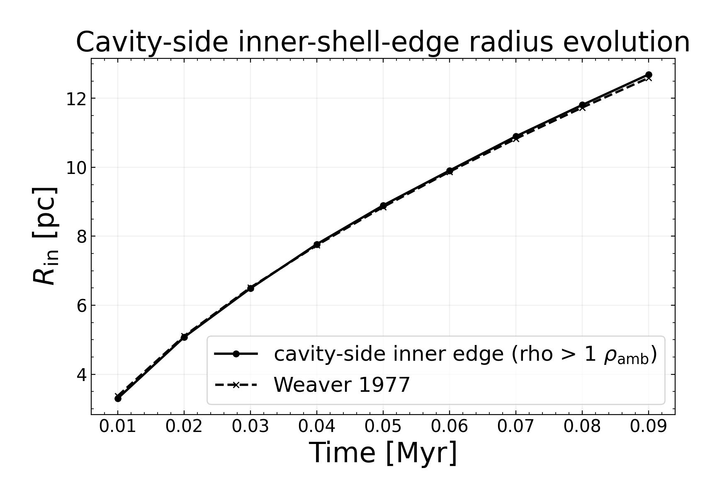
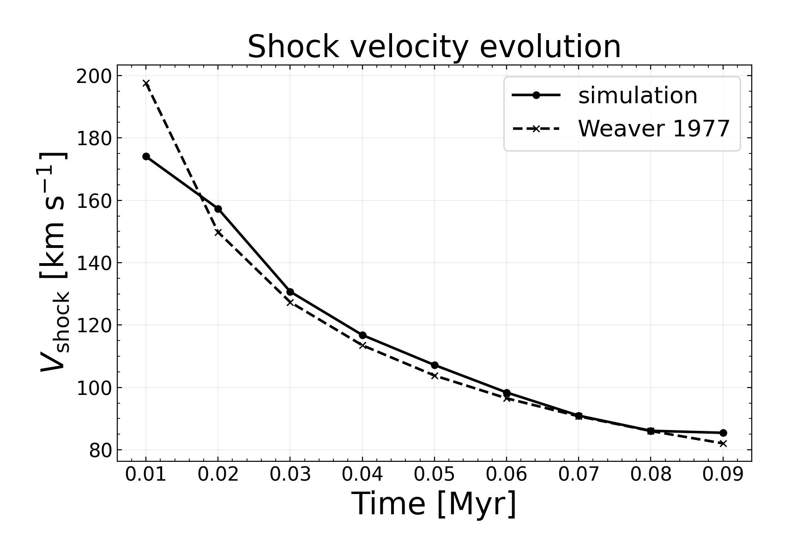
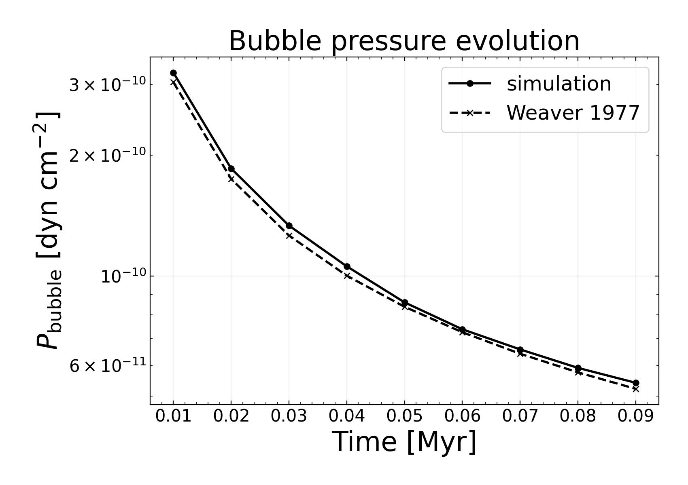

Examples
========

Example scripts live under ``example/``. They construct an initial-condition
file, run :class:`radhydropy.rsim.Rsim`, and often plot the output.

Available Examples
------------------

.. list-table::
   :header-rows: 1
   :widths: 30 70

   * - Directory
     - Scenario
   * - ``example/Advection1D``
     - Cartesian one-dimensional advection.
   * - ``example/AdvectionSph1D``
     - Spherical one-dimensional advection.
   * - ``example/HIIRegionExpansion1D``
     - Spherical H II region expansion with hydrodynamics and a simplified
       piecewise-isothermal neutral/ionized equation of state.
   * - ``example/HydrostaticEquilibrium1D``
     - Cartesian isothermal atmosphere in a constant gravitational field used as
       a hydrostatic-equilibrium check.
   * - ``example/HydrostaticEquilibriumSphericalPointMass1D``
     - Spherical isothermal hydrostatic equilibrium in a point-mass potential
       without including the origin.
   * - ``example/BallisticInfallSphericalPointMass1D``
     - Spherical ballistic infall in a point-mass potential without including the
       origin.
   * - ``example/Inflow1D``
     - Cartesian inflow setup.
   * - ``example/InflowSph1D``
     - Spherical inflow setup.
   * - ``example/HydrogenCooling1D``
     - Uniform ionized hydrogen box with cooling and chemistry enabled.
   * - ``example/HydrogenRecombination1D``
     - Fixed-temperature case-B hydrogen recombination box.
   * - ``example/Outflow1d``
     - Cartesian outflow setup.
   * - ``example/OutflowSph1d``
     - Spherical outflow setup.
   * - ``example/StellarWindBubble1D``
     - Spherical stellar-wind bubble setup with a Weaver et al. 1977
       energy-driven shell reference.
   * - ``example/RadiativeTransferSph1D``
     - Spherical central-source long-characteristic radiative transfer without
       hydrodynamic or thermo-chemical evolution.
   * - ``example/StaticStromgrenSphere1D``
     - Static spherical Stromgren benchmark with constant density, temperature,
       radiative transfer, and implicit hydrogen chemistry.
   * - ``example/SedovTaylor1D``
     - Cartesian Sedov-Taylor blast-wave setup with analytic helper.
   * - ``example/SedovTaylorSph1d``
     - Spherical Sedov-Taylor blast-wave setup with analytic helper.
   * - ``example/SodShock1D``
     - Sod shock tube setup with analytic helper.

Running An Example
------------------

Run examples from their own directory so relative output paths and analytic
helper imports resolve correctly:

.. code-block:: bash

   cd example/SodShock1D
   python sodshock1d.py

Most scripts write ``InitialCondition.hdf5`` and one or more ``Output_*.hdf5``
files in the example directory.

Stellar Wind Bubble
-------------------

The ``example/StellarWindBubble1D`` case evolves a spherically symmetric,
energy-driven stellar-wind bubble following the Weaver et al. (1977)
similarity solution. It injects a fast wind into a low-density ambient medium
and compares the resulting bubble growth against analytic radius, velocity,
and pressure tracks.

The plotting script produces four comparison figures:

* density and temperature profiles with the analytic shock location marked at
  each snapshot;
* a cavity-side inner-shell-edge radius comparison against the Weaver
  solution;
* a shock-velocity comparison against the Weaver solution; and
* a bubble-pressure comparison against the Weaver solution.

The profiles are useful for checking the shell structure directly, while the
time-series plots show whether the simulated bubble follows the expected
energy-driven scaling.

   Density and temperature profiles with the analytic shock location marked
   for each snapshot.

   Cavity-side inner-shell-edge radius compared against the Weaver et al.
   (1977) radius.

   Shock velocity compared against the Weaver et al. (1977) solution.

   Bubble pressure compared against the Weaver et al. (1977) solution.
