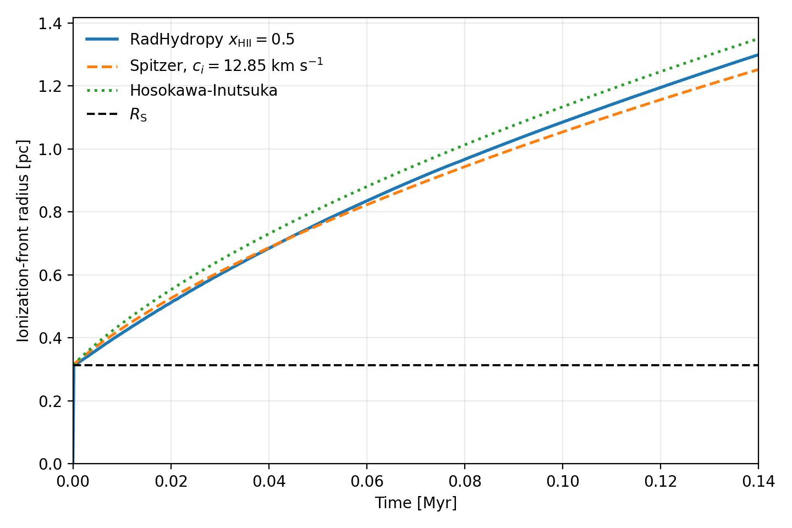
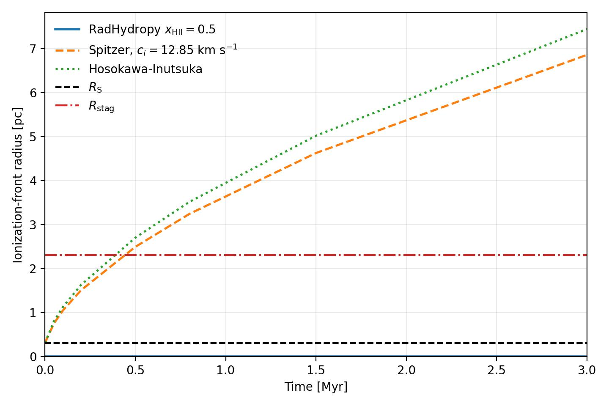
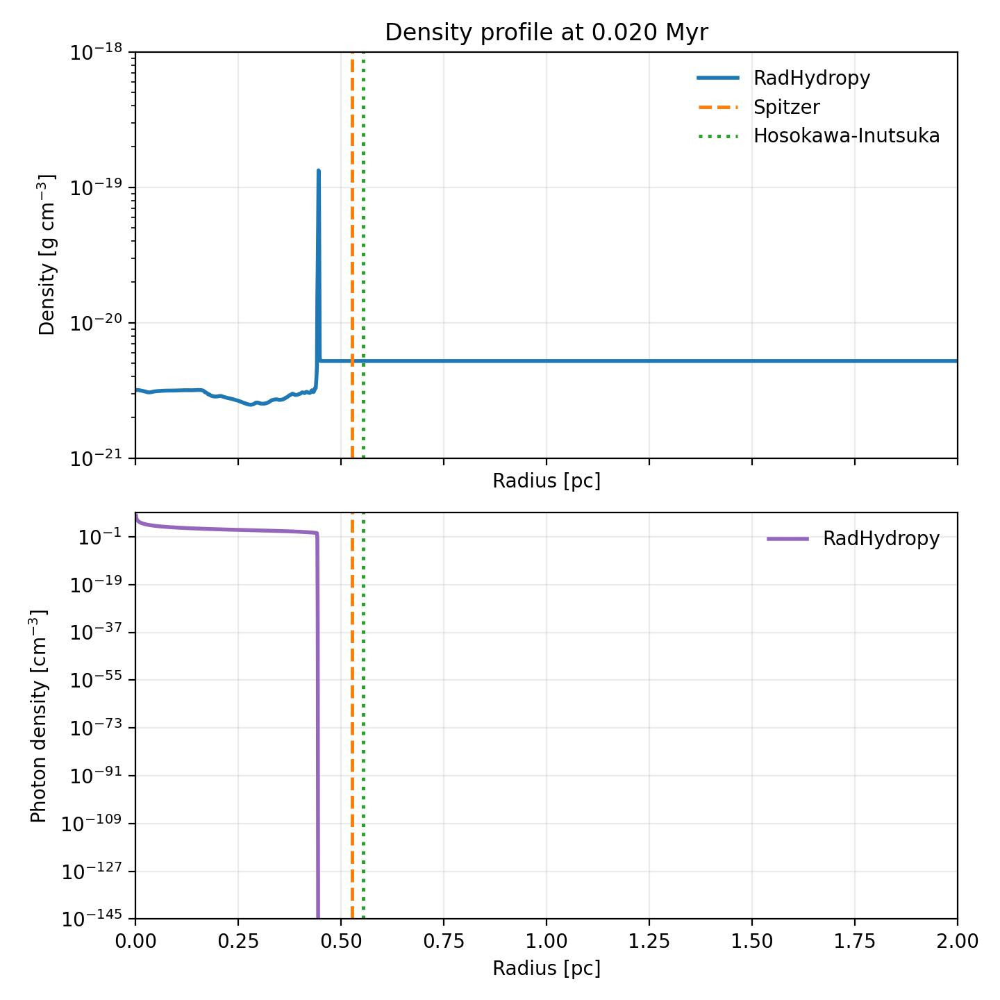
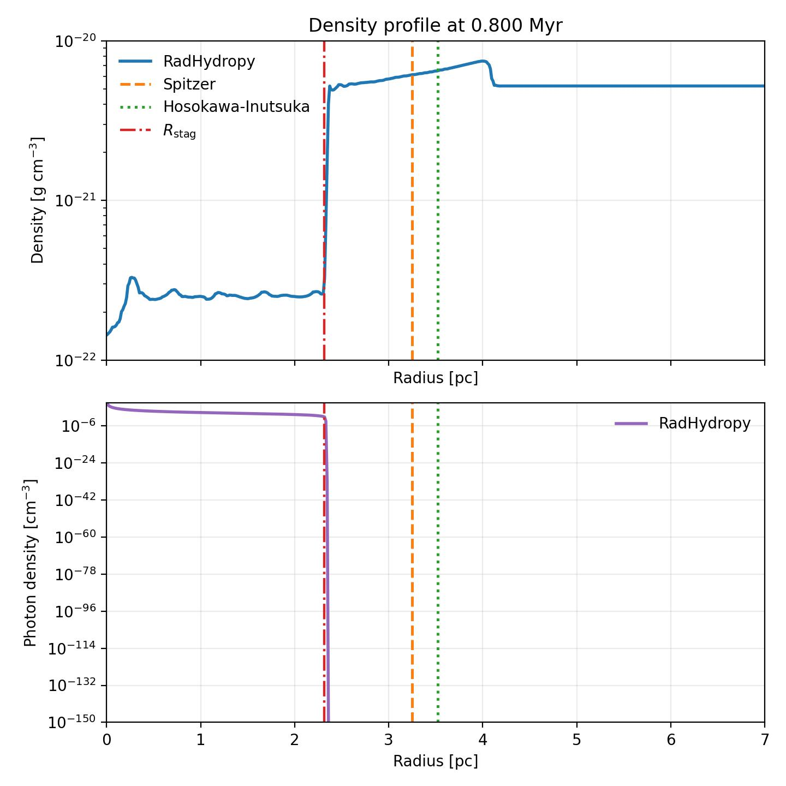

H II Region Expansion 1D
========================

The ``example/HIIRegionExpansion1D`` case evolves a spherically symmetric H II
region through both an early, rapidly evolving phase and a later, slower
expansion phase. The repository includes separate scripts and plots for the two
regimes so that both the ionization front and the gas density structure can be
checked against the corresponding expected behavior.

   Early-time ionization-front evolution.

   Late-time ionization-front evolution.

   Representative early-time density profile.

   Representative late-time density profile.

C²-Ray variants
---------------

Both phases also have C²-Ray configurations:

.. code-block:: bash

   cd example/HIIRegionExpansion1D
   python early_hii_region_expansion1d.py \
      --config early_hii_region_expansion1d_c2ray.yaml
   python late_hii_region_expansion1d.py \
      --config late_hii_region_expansion1d_c2ray.yaml

The variants retain the original early and late phase parameters, meshes, and
output-time schedules. They use ``Output_C2Ray`` and
``Output_lateHII_C2Ray`` prefixes, respectively, so the C²-Ray snapshots do
not overwrite the default runs. Their figures use ``_C2Ray`` suffixes, for
example ``EarlyHIIRegionExpansion1D_C2Ray_IFront.jpg`` and
``LateHIIRegionExpansion1D_C2Ray_IFront.jpg``. The H II expansion example
uses a tighter, warning-based local C²-Ray iteration policy because its early
phase contains very optically thick cells during the initial front formation.
