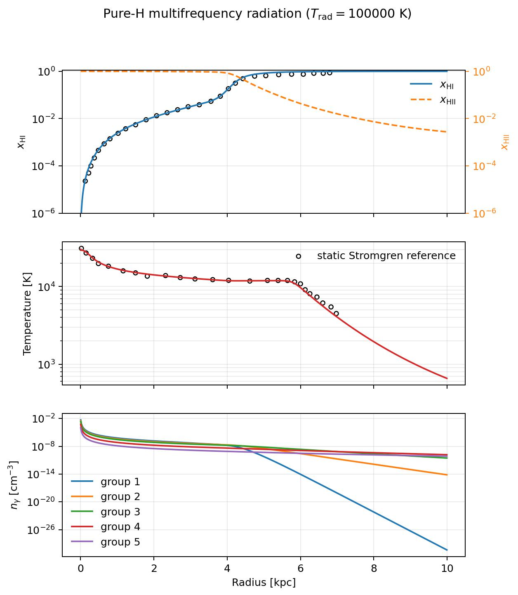
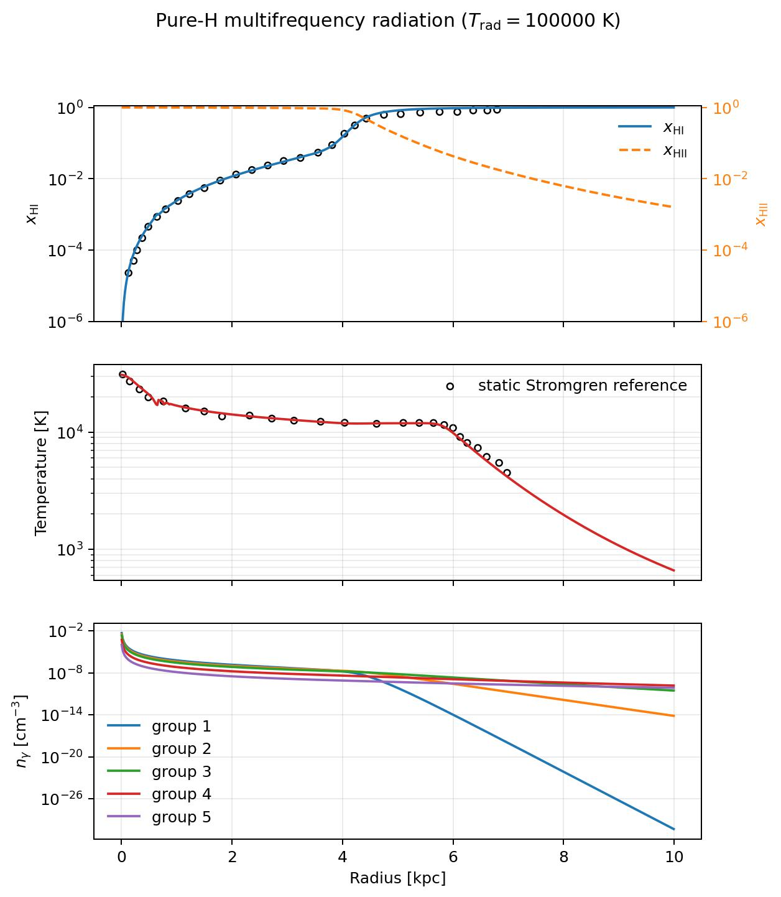
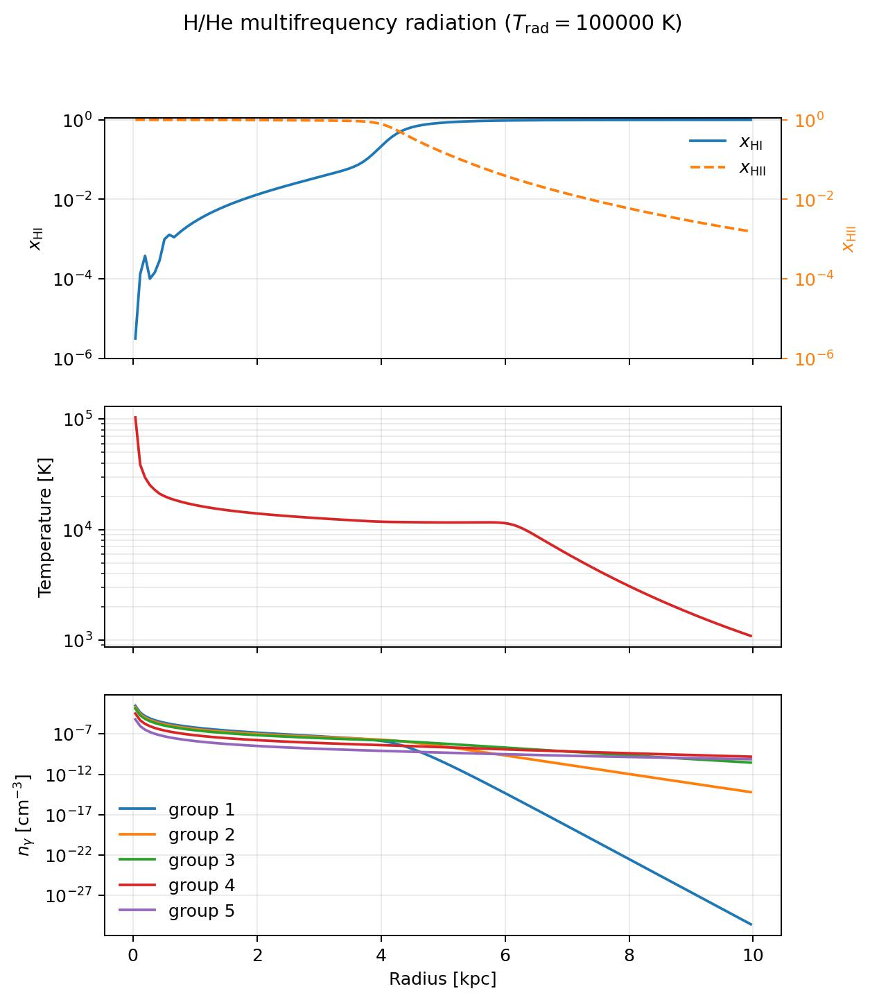
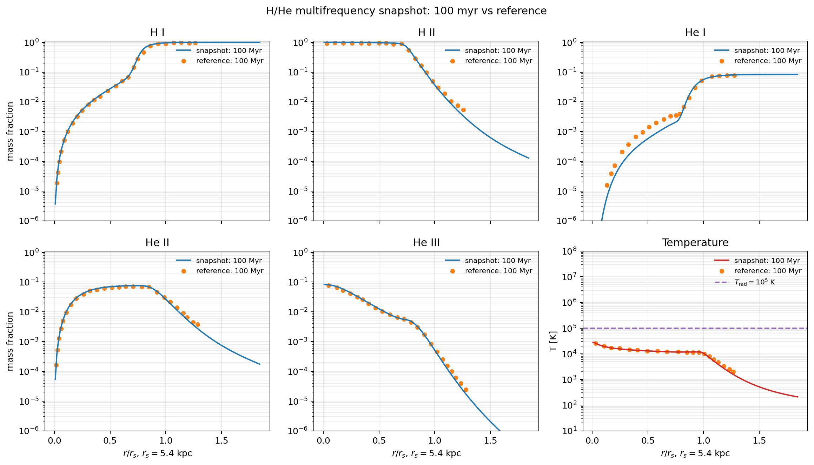
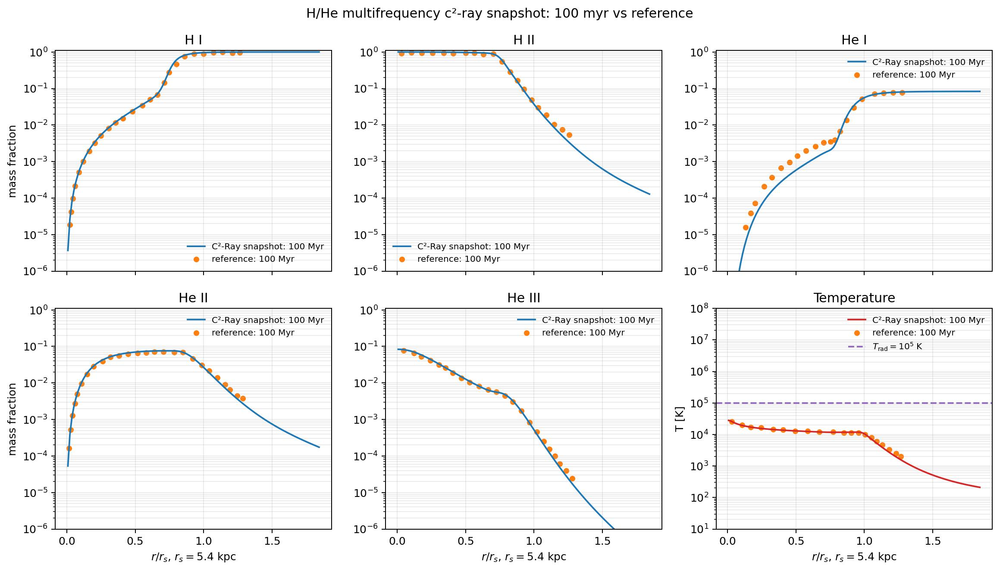

Multifrequency Radiative Transfer Spherical Example
====================================================

The example is located at
``example/MultiFrequencyRadiativeTransferSph1D``. It evolves a static,
uniform pure-hydrogen medium with spherical long-characteristic transport,
hydrogen thermo-chemistry, photoheating, and cooling.

Running the example
-------------------

From the example directory::

   python multifrequency_radiative_transfer_sph1d.py \
     --config multifrequency_radiative_transfer_sph1d.yaml

The default setup uses five groups with edges
``[13.6, 24.6, 35.5, 54.4, 75.0, 50000] eV`` and a ``10^5 K`` blackbody spectrum. The
simulation has ``n_H = 10^-3 cm^-3``, 512 spherical cells, and evolves to
100 Myr.

The same setup can be run with the causal C²-Ray temporal update using a
separate configuration and output set::

   python multifrequency_radiative_transfer_sph1d.py \
     --config multifrequency_radiative_transfer_sph1d_c2ray.yaml

This writes ``InitialCondition_C2Ray.hdf5``, ``Output_C2Ray_000.hdf5``, and
``MultiFrequencyRadiativeTransferSph1D_C2Ray.jpg``. The five frequency groups
are transported causally from the central source while the hydrogen state and
temperature evolve over the 0.5 Myr source steps.

HDF5 spectrum input
-------------------

The generation utility and its command-line options are documented in
:doc:`radiation_spectrum_generator`.

The YAML parameter ``radiation_spectrum_filename`` points to an HDF5 file.
RadHydropy loads this file during :class:`radhydropy.params.Par` startup and
reloads it after initial-condition HDF5 headers are read, preserving the
physical units of the spectrum data.

The file contains a ``RadiationSpectrum`` group with:

* ``group_edges_eV``;
* ``ionizing_photon_energy_erg``;
* ``star_emission_rates``;
* ``group_sigma_gamma_cm2``;
* ``group_epsilon_gamma_erg``.

The group attributes include the number of radiation groups and group edges,
spectrum type, blackbody temperature, and absorber. A matching file can be
generated with::

   python tools/radiation_spectrum_generator/generate_radiation_spectrum.py

Total source normalization
--------------------------

The optional parameter ``radiation_spectrum_total_photon_rate`` overrides the
total ionizing photon injection rate while preserving the relative group
spectrum::

   radiation_spectrum_total_photon_rate:
     value: 5.0e48
     unit: 1/s

When omitted, the HDF5 file's normalization is retained. The first
``star_emission_rates`` entry is a non-ionizing placeholder; the remaining
entries are the ionizing groups.

Hydrogen network
----------------

The example sets ``hydrogen_alpha_B`` and ``hydrogen_beta`` to ``null`` so the
built-in temperature-dependent rates are used. Collisional ionization and
thermal coupling are enabled. The pure-hydrogen configuration uses the H I
datasets from the H/He spectrum file. The H/He configuration additionally uses
the He I and He II datasets.

Outputs and references
----------------------

The run writes ``InitialCondition.hdf5``, ``Output_000.hdf5``, and
``MultiFrequencyRadiativeTransferSph1D.jpg``. The plot shows the neutral
fraction, temperature, and photon number density of each group.

Example figures
---------------

The pure-hydrogen run produces the following radial profiles. The upper panel
shows the neutral and ionized fractions, the middle panel shows the gas
temperature, and the lower panel shows the photon number density in each
radiation group.

   Pure-hydrogen multifrequency radiation at 100 Myr.

The C²-Ray version produces the corresponding profiles below. The plotted
group photon densities show the causal, group-dependent attenuation through
the neutral outer medium.

   Pure-hydrogen multifrequency C²-Ray radiation at 100 Myr.

The repository also includes an H/He variant using the
``hydrogen_helium`` thermo-chemistry network. Its output includes the same
hydrogen and radiation profiles while evolving the helium species.

   Hydrogen and helium multifrequency radiation at 100 Myr.

The H/He snapshot can also be compared directly with the supplied static
Strömgren-sphere reference profiles. The comparison shows H I, H II, He I,
He II, He III, and temperature as functions of normalized radius.

The H/He variant can use the same causal update with
``multifrequency_radiative_transfer_sph1d_hhe_100myr_c2ray.yaml``::

   cd example/MultiFrequencyRadiativeTransferSph1D_HHe_100Myr
   python multifrequency_radiative_transfer_sph1d_hhe_100myr.py \
     --config multifrequency_radiative_transfer_sph1d_hhe_100myr_c2ray.yaml

This selects the H/He C²-Ray path because it sets
``thermochemistry_network`` to ``hydrogen_helium`` and
``radiative_transfer_temporal_scheme`` to ``c2ray``.
It writes ``Output_C2Ray_*.hdf5`` and
``MultiFrequencyRadiativeTransferSph1D_HHe_100Myr_C2Ray.jpg``. In each cell,
the local coupled H/He and thermal solve uses the transmitted multifrequency
photon field, and the resulting time-averaged H I, He I, and He II opacity is
used for the next causal transport update.

All five photon groups contribute to the local photoionization and
photoheating rates. This is essential for helium: He II can only absorb
photons above 54.4 eV, so the fourth and fifth groups drive the He III profile.
The evolved group photon densities are also copied back to ``fluid.ngamma``
and are therefore available in the HDF5 output.

   H/He snapshot and reference profiles at 100 Myr.

The corresponding C²-Ray result can be compared with the same reference
profiles using the generated figure below.

   H/He C²-Ray snapshot and reference profiles at 100 Myr.

``TTT1D_Stromgren100Myr.txt`` and ``xTT1D_Stromgren100Myr.txt`` contain the
multifrequency comparison profiles. Their radius is normalized by
``r_s = 5.4 kpc``; their second columns contain ``log10(T/K)`` and
``log10(x_HI)``, respectively.
