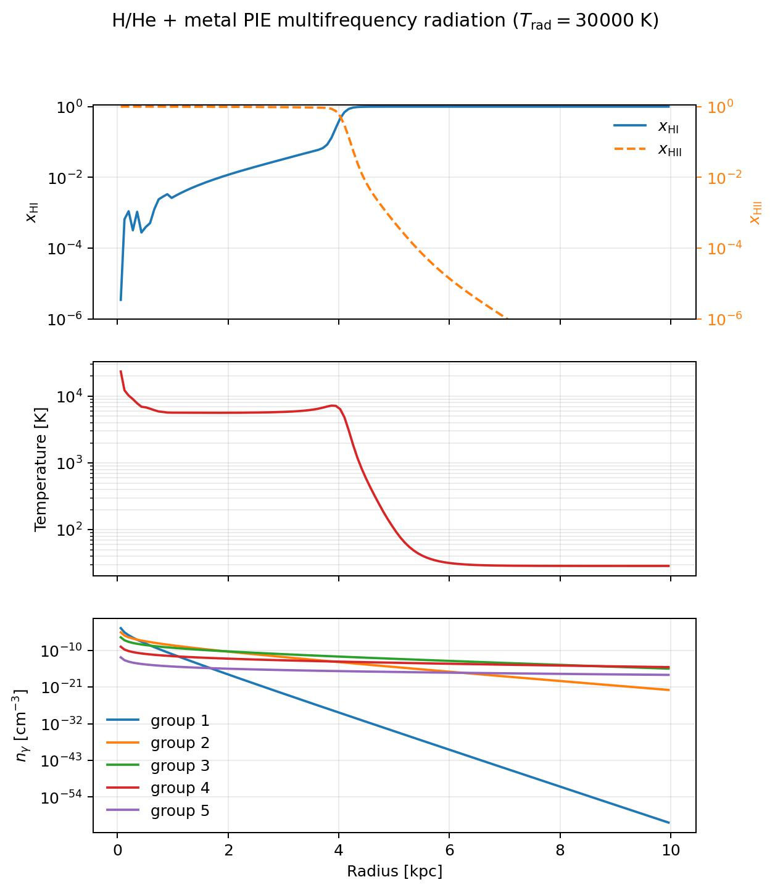
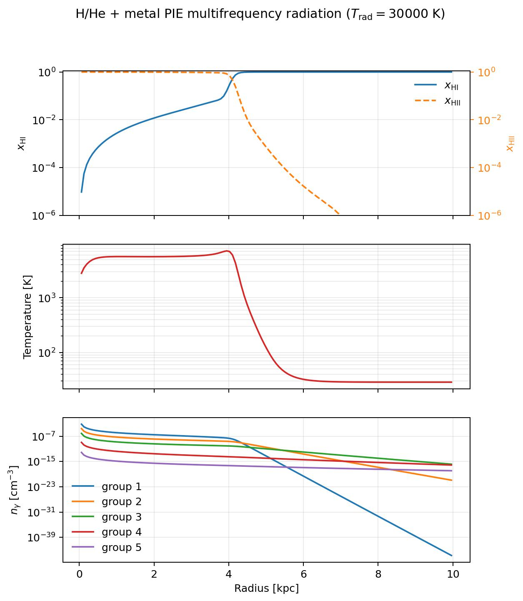

H/He Multifrequency Radiative Transfer with Metal PIE Cooling
===============================================================

This example is located at
``example/MultiFrequencyRadiativeTransferSph1D_HHe_30000K_100Myr``. It is a
static, spherically symmetric Strömgren-sphere calculation with five-group
long-characteristic radiation transport, non-equilibrium hydrogen/helium
thermo-chemistry, and optional metal photoionization-equilibrium (PIE)
heating and cooling.

The example uses a ``30,000 K`` blackbody source and evolves a uniform gas for
100 Myr. Metals are included only through the PIE heating/cooling table. They
do not contribute nuclei to the equation of state, mean molecular mass, or
H/He radiation opacity.

Physical setup
--------------

The principal parameters are:

.. list-table::
   :header-rows: 1
   :widths: 36 44

   * - Parameter
     - Value
   * - Hydrogen mass fraction ``X``
     - ``0.75``
   * - Helium mass fraction ``Y``
     - ``0.25``
   * - Hydrogen number density
     - ``10^-3 cm^-3``
   * - Initial temperature
     - ``100 K``
   * - Number of cells
     - ``128`` spherical cells
   * - Box radius
     - ``10 kpc``
   * - Source spectrum
     - ``30,000 K`` blackbody
   * - Total ionizing photon rate
     - ``5 * 10^48 s^-1``
   * - Runtime
     - ``100 Myr``
   * - Metallicity
     - ``Z/Zsun = 1``

The spectrum is read from
``tools/radiation_spectrum_generator/radiation_spectrum_BB30000K_5groups_HHe.h5``.
Its photon-energy edges are

.. code-block:: text

   [13.6, 24.6, 35.5, 54.4, 75.0, 50000.0] eV

The five groups use H I, He I, and He II group-averaged cross-sections and
photoheating energies stored in the spectrum file. The YAML parameter
``radiation_spectrum_total_photon_rate`` rescales the spectrum to the desired
total source rate without changing the relative group emission rates.

Metal PIE coupling
------------------

Metal cooling is enabled in the YAML file with:

.. code-block:: yaml

   metal_pie_enabled: true
   metal_pie_table_filename: ../../../metal_pie_table/metal_pie_table_Z1_metals.h5
   metallicity: 1.0

The source update follows this sequence:

1. Trace the five radiation groups through the current H/He neutral fractions.
2. Compute ``U = sum(n_gamma,g) / nH`` in each cell.
3. During the coupled local H/He implicit update, interpolate metal heating and
   cooling in ``log10(T)``, ``log10(nH)``, and ``log10(U)``.
4. Update H I, H II, He I, He II, He III, and the thermal energy.
5. Retrace the five groups once with the updated H/He fractions.

The metal table contains volumetric rates in ``erg cm^-3 s^-1``. Its net
contribution is:

.. math::

   \dot e_{\rm metal} =
   \dot e_{\rm photoheat,metal} - \dot e_{\rm cool,metal}.

The supplied table has ``log10(U)`` limits of ``[-7, 0]``. Values outside the
tabulated domain are clipped to the nearest table boundary; for production
runs, the table should cover the expected temperature, density, and
ionization-parameter range.

Running the example
--------------------

Run it from its directory so that the relative spectrum and PIE-table paths
resolve correctly:

.. code-block:: bash

   cd example/MultiFrequencyRadiativeTransferSph1D_HHe_30000K_100Myr
   python multifrequency_radiative_transfer_sph1d_hhe_30000k_100myr.py

The run can also be given an alternate YAML file:

.. code-block:: bash

   python multifrequency_radiative_transfer_sph1d_hhe_30000k_100myr.py \
      --config multifrequency_radiative_transfer_sph1d_hhe_30000k_100myr.yaml

The optional C²-Ray H/He plus metal-PIE configuration is:

.. code-block:: bash

   python multifrequency_radiative_transfer_sph1d_hhe_30000k_100myr.py \
      --config multifrequency_radiative_transfer_sph1d_hhe_30000k_100myr_c2ray.yaml

This keeps H and He non-equilibrium while including the PIE metal
heating-minus-cooling rate inside every implicit thermal trial. Metals remain
an equilibrium thermal closure: they are not added to the H/He opacity,
electron density, or mean molecular weight.

The script writes ``InitialCondition.hdf5``, ``Output_000.hdf5``,
``used_parameters.yaml``, and the diagnostic PIE figure in the example
directory.

Example figure
--------------

The upper panel shows the H I and H II fractions, the middle panel shows the
temperature, and the lower panel shows the photon number density in each
radiation group. The title records the 30,000 K radiation temperature.

   H/He multifrequency radiation transport with solar-metallicity PIE heating
   and cooling after 100 Myr.

The corresponding causal C²-Ray run is written with a separate PIE-labelled
filename:

   H/He C²-Ray radiation transport with solar-metallicity PIE heating and
   cooling after 100 Myr.

Related documentation
---------------------

* :doc:`multifrequency_radiative_transfer_sph1d`
* :doc:`radiation_spectrum_generator`
* :doc:`thermo_chemistry`
* :doc:`parameters`
