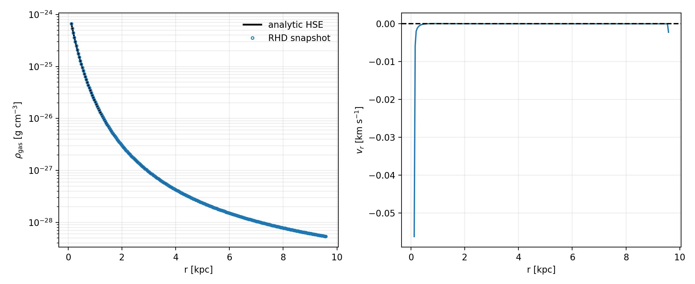

NFW Hydrostatic Equilibrium 1D
==============================

The ``example/NFWHydrostaticEquilibrium1D`` case places isothermal gas in a
``1e8 Msun`` NFW dark-matter halo. Its default assumptions are ``z=0``,
``Delta=200``, concentration ``c=10``, ``mu=0.59``, and a gas mass of
``0.157 M_200``. The halo is an external potential and gas self-gravity is
excluded.

The halo parameters are derived from

.. math::

   R_{200} = \left(\frac{3M_{200}}{4\pi\,200\,\rho_{\rm crit}}\right)^{1/3},
   \qquad r_s = R_{200}/c.

The gas temperature is set to

.. math::

   T_{\rm vir} = \frac{\mu m_p}{2 k_B}\frac{G M_{200}}{R_{200}}.

For this isothermal gas, hydrostatic balance gives

.. math::

   \rho_g(r) = \rho_g(r_0)
   \exp\left[-\frac{\mu m_p}{k_B T_{\rm vir}}
   \left(\Phi_{\rm NFW}(r)-\Phi_{\rm NFW}(r_0)\right)\right].

Running the example
-------------------

From the example directory::

   python nfw_hydrostatic_equilibrium1d.py

The generated figure compares the evolved density with the analytic profile
and shows the radial velocity residual. The default run gives approximately
``R_200 = 9.57 kpc``, ``r_s = 0.957 kpc``, and ``T_vir = 1.61e3 K``.

   NFW hydrostatic-equilibrium verification for the ``1e8 Msun`` halo.
