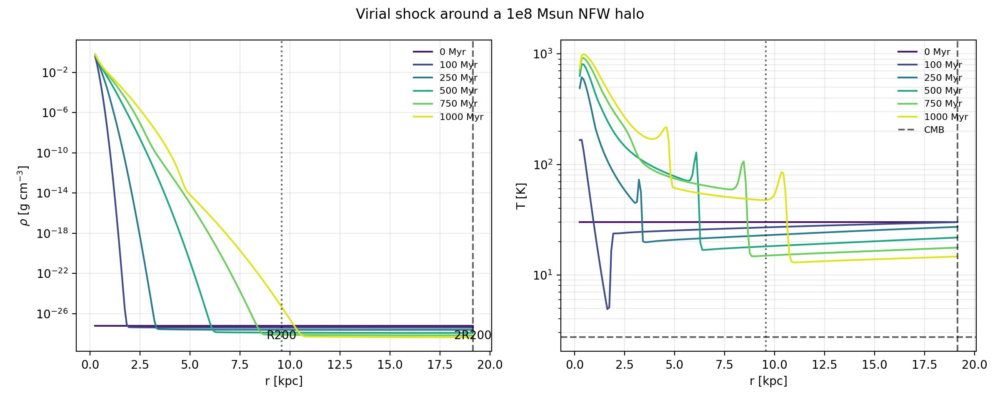

NFW Virial Shock 1D
===================

The ``example/NFWVirialShock1D`` case uses the same ``1e8 Msun`` NFW halo as
the hydrostatic-equilibrium example. The gas is initialized everywhere at the
cosmic-mean baryon density, with the cosmological Hubble velocity and a CMB
temperature at the chosen initial redshift. The central dark-matter
perturbation is represented by the fixed NFW mass profile. ``2 R_200`` is only
the outer computational radius; there is no Gaussian or finite gas shell.

The calculation uses an adiabatic equation of state with ``gamma=5/3`` and no
cooling. Post-processing identifies the strongest compressive temperature
front and compares its measured density and temperature jumps with the
finite-Mach Rankine--Hugoniot relations.

Running the example
-------------------

From the example directory::

   python nfw_virial_shock1d.py

The generated figure shows the density and temperature evolution of the
mean-density gas. The accompanying ``NFWVirialShock1D_RankineHugoniot.txt``
file records the detected front, shock speed, Mach number, and measured versus
predicted jump ratios.

   Density and temperature evolution of the mean-density gas.
