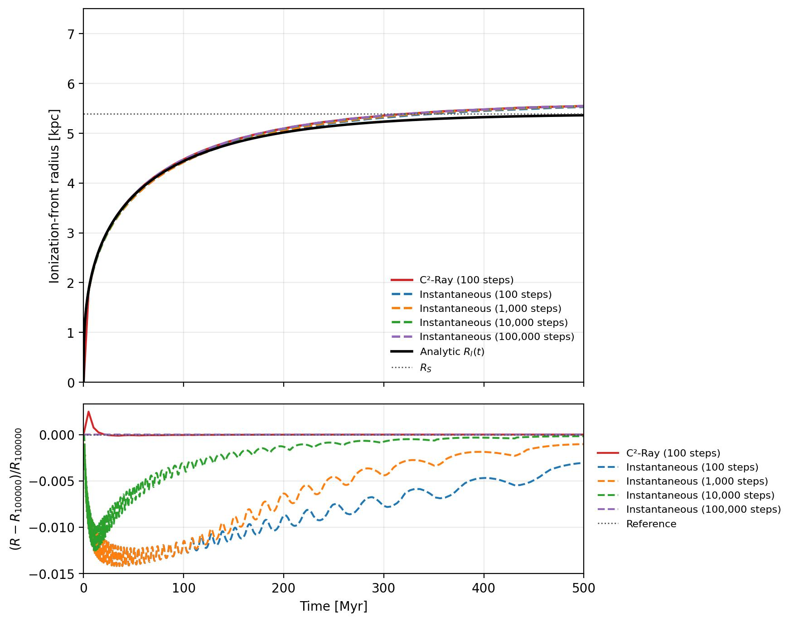

Static Strömgren Sphere: C²-Ray Timestep Comparison
====================================================

The ``example/StaticStromgrenC2RayComparison`` case measures how the
ionization-front trajectory changes when the temporal update is switched from
the instantaneous photon transport update to the causal C²-Ray update. It is
based on ``example/StaticStromgrenSphere1D`` and keeps the gas density and
temperature fixed, so the comparison isolates the radiation/chemistry time
integration.

The example uses a spherical mesh with 256 cells covering 20 kpc. The gas has
``n_H = 10^-3 cm^-3`` and the central source emits ``5 x 10^48 s^-1`` ionizing
photons. Case-B recombination is enabled with
``alpha_B = 2.59 x 10^-13 cm^3 s^-1``. Hydrodynamics, photoheating, and
collisional ionization are disabled.

Running the comparison
----------------------

Run the script from its example directory:

.. code-block:: bash

   cd example/StaticStromgrenC2RayComparison
   python static_stromgren_c2ray_comparison.py

The YAML file contains the mesh and physical parameters as well as the
comparison schedule:

* C²-Ray: 100 global source/chemistry steps;
* instantaneous transport: 100 steps;
* instantaneous transport: 1,000 steps;
* instantaneous transport: 10,000 steps; and
* instantaneous transport: 100,000 steps.

Each case uses a fresh initial-condition file and writes its snapshot below
``comparison_runs/<case>/``. The step count is converted into a uniform
global timestep over the 500 Myr run. The 100-step C²-Ray case therefore uses
the same coarse global cadence as the 100-step instantaneous case, while the
100,000-step instantaneous case serves as the time-resolution reference.

The runner follows the normal RadHydropy IC-driven workflow: it builds and
writes the initial condition, reloads it through ``Rsim``, initializes the
mesh and fluid, evolves the static thermochemistry, and saves an HDF5 output
for every case.

Ionization-front comparison
---------------------------

The front is defined as the radius where the neutral hydrogen fraction is
``x_HI = 0.5``. The generated figure contains two panels:

   Ionization-front trajectories and their relative differences from the
   100,000-step instantaneous reference.

The comparison is derived from the standalone static Strömgren benchmark.
Its reference figures are included here to make the physical setup and the
photon accounting visible alongside the timestep comparison:

.. figure:: ../example/StaticStromgrenSphere1D/StaticStromgrenSphere1D.jpg
   :width: 49%
   :alt: Static Strömgren radial neutral and ionized fraction profiles

   Final radial neutral and ionized hydrogen fractions for the underlying
   static benchmark.

.. figure:: ../example/StaticStromgrenSphere1D/StaticStromgrenSphere1D_PhotonBudget.jpg
   :width: 49%
   :alt: Static Strömgren photon budget

   Photon-budget diagnostic for the same fixed-density source problem.

.. figure:: ../example/StaticStromgrenSphere1D/StaticStromgrenSphere1D_IFront.jpg
   :width: 100%
   :alt: Static Strömgren reference ionization-front history

   The single-scheme benchmark history used as the starting point for the
   multi-timestep C²-Ray comparison.

The upper panel shows the front radius for all five numerical cases, together
with the analytic static Strömgren trajectory and equilibrium Strömgren
radius. The analytic trajectory is shown only as a physical benchmark; it is
not used as the numerical reference in the lower panel.

The lower panel compares each numerical trajectory to the 100,000-step
instantaneous trajectory. For a case with front radius ``R`` and reference
radius ``R_ref``, it plots

.. math::

   \frac{R - R_{\rm ref}}{R_{\rm ref}}.

The reference curve is identically zero. Since all fronts start at zero, the
relative difference is set to zero at the initial sample rather than dividing
by zero. For the other samples, reference values are linearly interpolated
onto each case's output times before forming the ratio.

Outputs
-------

The script writes:

``StaticStromgrenC2RayComparison_IFront.jpg``
   The two-panel trajectory and relative-difference plot.

``StaticStromgrenC2RayComparison_IFront.csv``
   The sampled case label, time, numerical front radius, analytic front
   radius, and absolute analytic error.

``comparison_runs/<case>/Output_000.hdf5``
   The final saved state for each numerical case.

The CSV's analytic-error columns are diagnostic only. The convergence-style
comparison in the lower panel is always relative to the 100,000-step
instantaneous numerical run.
