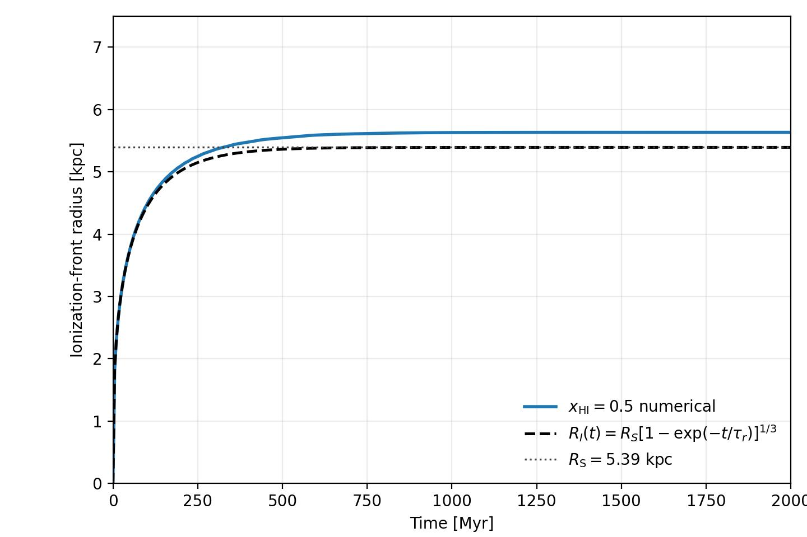
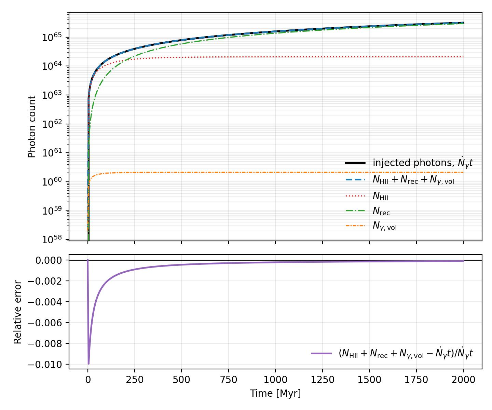
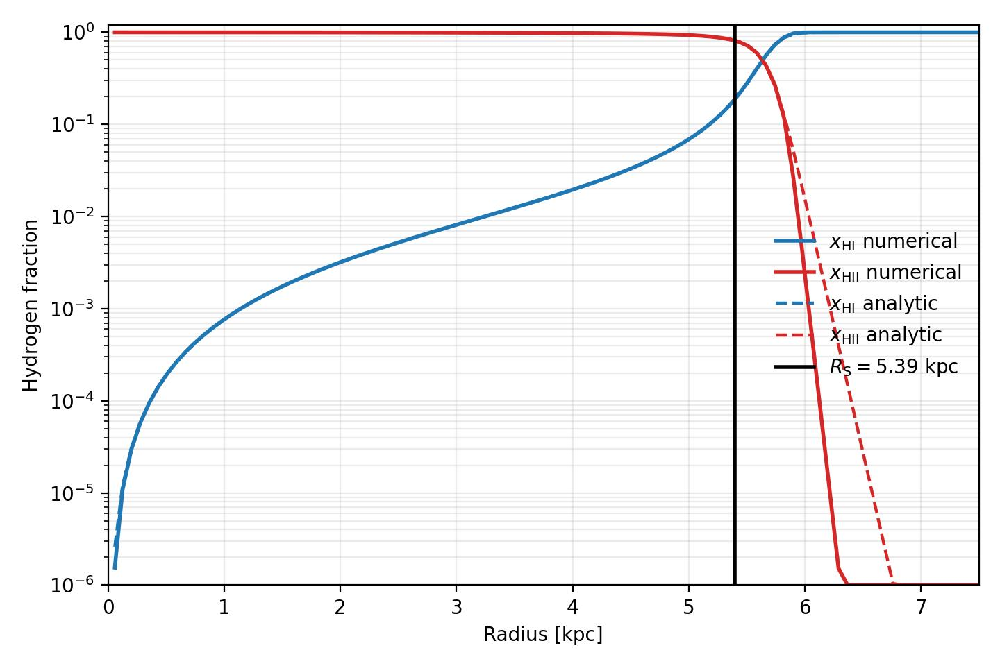

Static Stromgren Sphere 1D
==========================

The ``example/StaticStromgrenSphere1D`` case is a static benchmark with
constant density and temperature. It uses radiative transfer plus implicit
hydrogen chemistry to compare the ionization front and photon budget against an
analytic Stromgren-sphere reference.

   Ionization-front evolution in the static Stromgren benchmark.

   Photon-budget comparison for the static Stromgren benchmark.

   Example radial profile output for the static Stromgren benchmark.
