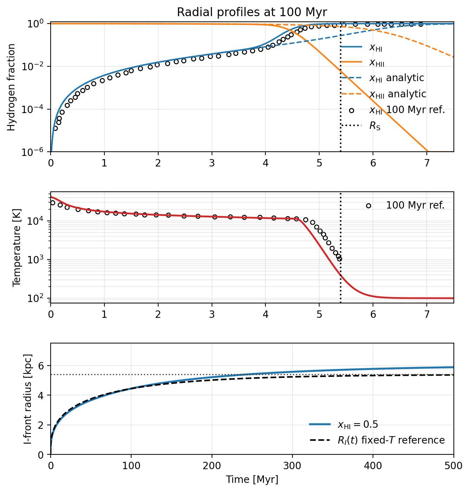
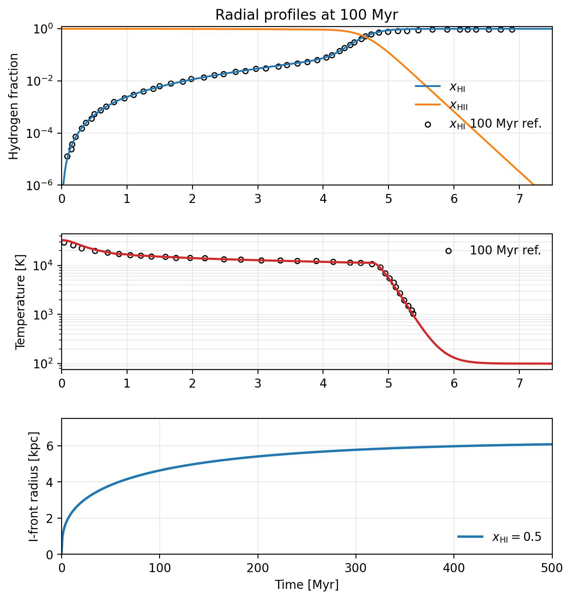

Static Stromgren Sphere Photoheating 1D
=======================================

The ``example/StaticStromgrenSpherePhotoheating1D`` case uses the same basic
ionization geometry as the static Stromgren benchmark but adds photoheating
and a temperature reference table. It is designed to check whether the thermal
response of the ionized region matches the precomputed benchmark profile.

   Static Stromgren sphere with photoheating compared against the reference
   profile.

C²-Ray variant
--------------

The same fixed-density photoheating problem can be run with the causal C²-Ray
temporal update:

.. code-block:: bash

   cd example/StaticStromgrenSpherePhotoheating1D
   python static_stromgren_sphere_photoheating1d.py \
      --config static_stromgren_sphere_photoheating1d_c2ray.yaml

This configuration keeps the original 1024-cell mesh, temperature-dependent
hydrogen rates, thermal coupling, source rate, and 1 Myr evolution timestep.
It writes ``InitialCondition_C2Ray.hdf5`` and ``Output_C2Ray_000.hdf5`` so it
does not overwrite the default run. The generated figure has the distinct
name ``StaticStromgrenSpherePhotoheating1D_C2Ray.jpg``.

   Photoheated static Strömgren sphere evolved with the C²-Ray temporal
   update.
