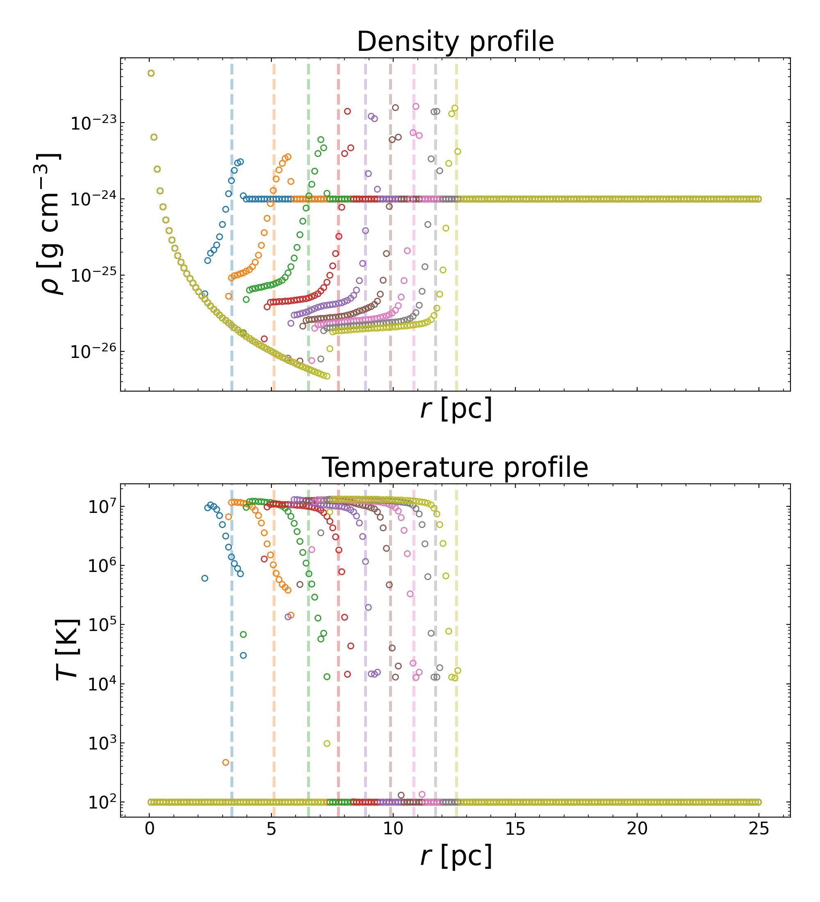
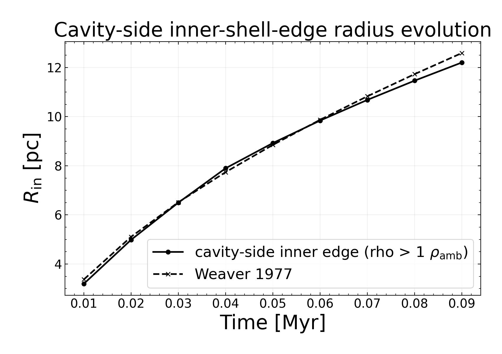
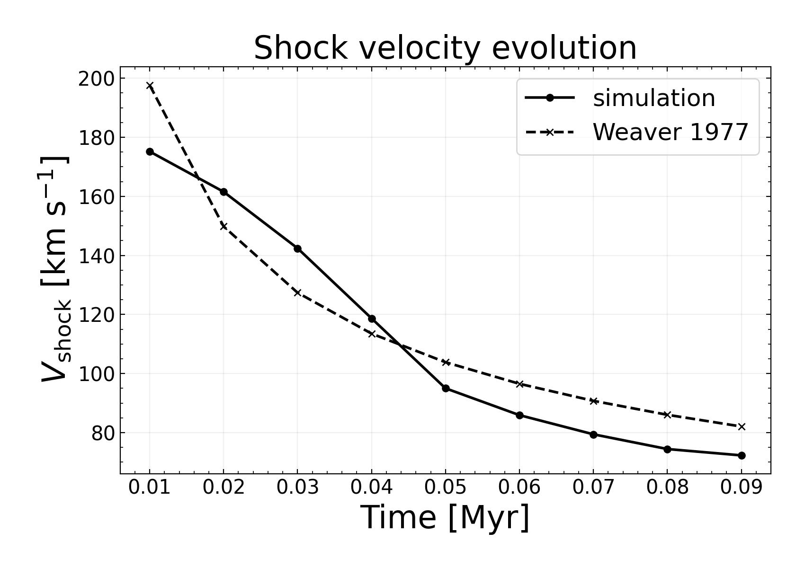
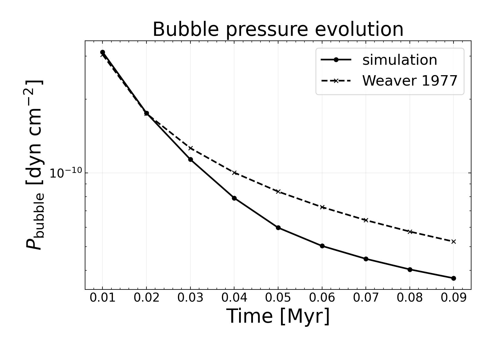

Stellar Wind Bubble 1D
======================

The ``example/StellarWindBubble1D`` case evolves a spherically symmetric,
energy-driven stellar-wind bubble following the Weaver et al. (1977)
similarity solution. It injects a fast wind into a low-density ambient medium
and compares the resulting bubble growth against analytic radius, velocity,
and pressure tracks.

Two YAML configurations are provided:

* ``stellar_wind_bubble1d.yaml`` uses CHIANTI CIE cooling with solar
  metallicity (``metallicity: 1.0``) and 70% hydrogen by mass.
* ``stellar_wind_bubble1d_no_metal.yaml`` uses the hydrogen network and a
  100% hydrogen composition. Hydrogen source evolution is disabled in this
  baseline configuration, so it provides a no-metal, no-radiative-cooling
  comparison.

The CIE run reads the ion-fraction and cooling tables from the sibling
``CHIANTI_11.0.2_database`` directory by default. CIE cooling is integrated
with explicit adaptive subcycling; the default ``cooling_safety_factor`` is
``0.1``. The source update enforces the configured
``cooling_temperature_floor``.

The plotting script produces four comparison figures for each configuration:

* density and temperature profiles with the analytic shock location marked at
  each snapshot;
* a cavity-side inner-shell-edge radius comparison against the Weaver
  solution;
* a shock-velocity comparison against the Weaver solution; and
* a bubble-pressure comparison against the Weaver solution.

The profiles are useful for checking the shell structure directly, while the
time-series plots show whether the simulated bubble follows the expected
energy-driven scaling.

   Density and temperature profiles for the metal-enriched run, with the
   analytic shock location marked for each snapshot.

   Metal-enriched cavity-side inner-shell-edge radius compared against the
   Weaver et al. (1977) radius.

   Metal-enriched shock velocity compared against the Weaver et al. (1977)
   solution.

   Metal-enriched bubble pressure compared against the Weaver et al. (1977)
   solution.

To run either configuration:

.. code-block:: bash

   cd example/StellarWindBubble1D
   python stellar_wind_bubble1d.py --config stellar_wind_bubble1d.yaml
   python stellar_wind_bubble1d.py --config stellar_wind_bubble1d_no_metal.yaml

Both configurations write their own initial-condition file and numbered
snapshots in the example directory (``InitialCondition.hdf5`` for the metal
case and ``InitialCondition_no_metal.hdf5`` for the baseline). Run them
separately if the snapshots need to be preserved. The figure prefixes remain
distinct: ``with_metal`` and ``no_metal``.

Both runs use ``OutflowSph`` and hydrodynamics ``order: 0``. Each verified
run writes ten numbered snapshots (``Output_000`` through ``Output_009``) and
completes the configured ``0.1 Myr`` evolution. The no-metal run is the
validated hydrogen-only, no-radiative-cooling baseline; ``order: 1`` is not a
supported configuration for this example.
