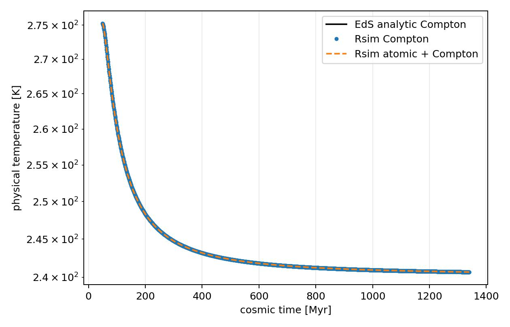

Uniform EdS Thermo-Chemistry
============================

This few-cell source-only benchmark evolves four uniform spherical gas cells
from the CMB temperature at ``z=100`` to ``z=10`` in an
Einstein--de Sitter cosmology.  The interval is scaled to approximately
1.3 Gyr so the temperature evolution is visible.

The example runs both a Compton-only case and an atomic-cooling-plus-Compton
case through ``Rsim.Run(mode="sources")``.  The Compton-only history is
compared with the analytic EdS temperature equation, while the atomic run is
shown as a numerical cooling comparison.
The configuration selects the coupled implicit source solver and sets the
fallback to ``error``, so neither run can silently use explicit subcycling.

Run it from the example directory:

.. code-block:: bash

   cd example/UniformEdSThermochemistry1D
   python uniform_eds_thermochemistry1d.py

The generated figure is:

The source files are available in the repository:

* :download:`run script <../example/UniformEdSThermochemistry1D/uniform_eds_thermochemistry1d.py>`
* :download:`configuration <../example/UniformEdSThermochemistry1D/uniform_eds_thermochemistry1d.yaml>`
