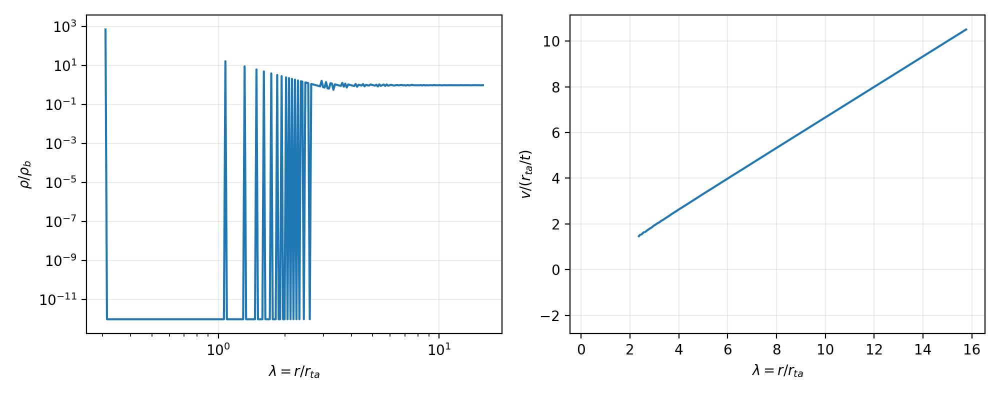
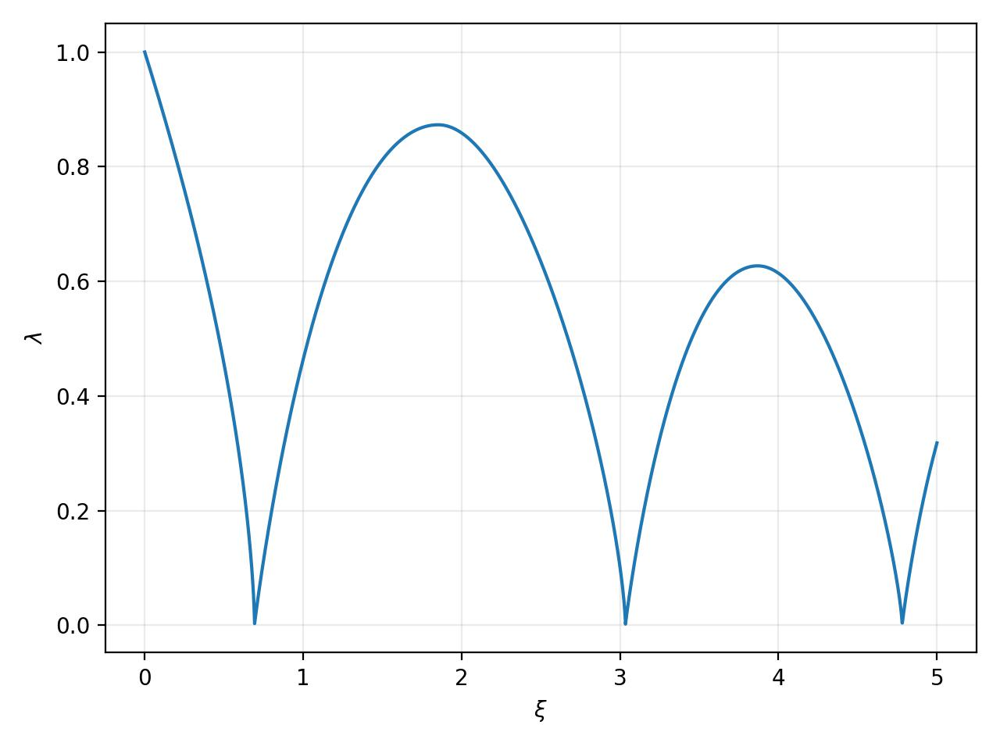
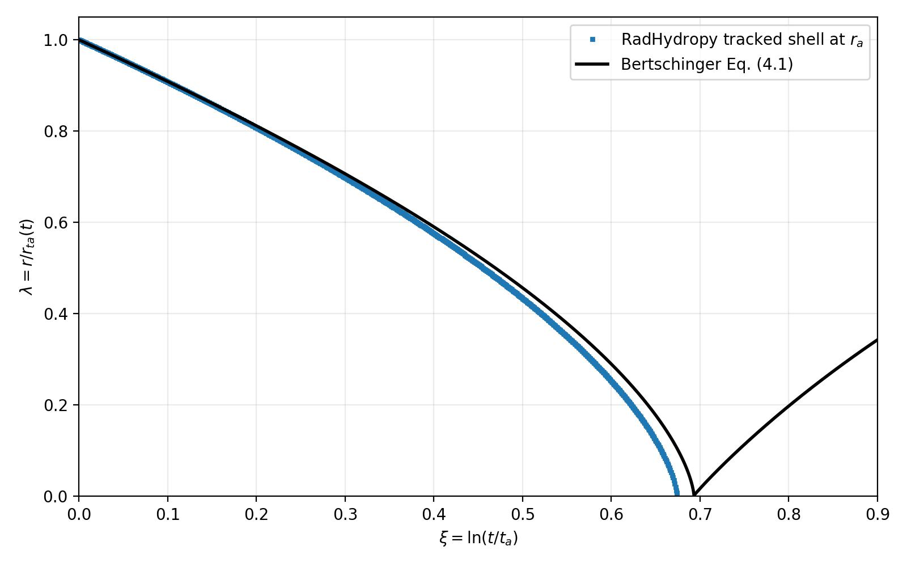

Bertschinger Collisionless Reference
====================================

This example generates the radial collisionless similarity reference for the
Einstein--de Sitter, ``epsilon=1`` secondary-infall problem. For this case

.. math::

   {\Delta M\over M}\propto M^{-1},\qquad
   r_{ta}\propto t^{8/9}.

Here ``epsilon`` is the perturbation-slope parameter,
``delta M/M ~ M**(-epsilon)``, not the gas adiabatic index. Thus ``epsilon=1``
means a constant excess mass, ``delta M = constant``. In the usual gas
extension, ``gamma=5/3`` is a separate thermodynamic parameter.

The implementation uses cold radial shells, a constant central perturbation
mass, cosmological background subtraction, shell crossing, and similarity
coordinates

.. math::

   \lambda={r\over r_{ta}},\qquad
   V={v\over r_{ta}/t},\qquad
   D={\rho\over\rho_b}.

It writes ``BertschingerReference.hdf5`` and
``BertschingerReference.jpg``. The Eq. (4.1) ODE also writes
``BertschingerEq41XiLambda.jpg``, plotting ``xi`` on the x-axis against
``lambda`` on the y-axis. This is
the collisionless reference stage;
the adiabatic gas shock solution is a separate follow-up problem.

Generated figures
------------------

   Density and velocity profiles from the collisionless shell reference.

   ODE trajectory with ``xi`` on the horizontal axis and ``lambda`` on the
   vertical axis.

Eq. 4.1 shell ODE
------------------

The example also integrates Bertschinger (1985), Eq. (4.1), which is the
collisionless dark-matter shell equation, not a gas equation:

.. math::

   {d^2\lambda\over d\xi^2}+{7\over9}{d\lambda\over d\xi}
   -{8\over81}\lambda=-{2\over9}{M(\lambda)\over\lambda^2}.

The initial conditions are exactly ``lambda(0)=1`` and
``lambda'(0)=-8/9``. The solver writes ``BertschingerEq41ODE.hdf5`` with
``xi``, ``lambda``, ``lambda_prime``, and ``mass`` datasets. The current ODE
test uses Bertschinger's normalized mass closure, sets
``ode_angular_momentum`` to zero, and continues through shell crossings.
Each monotonic phase-space branch is retained and the enclosed mass is
reconstructed with the alternating crossing sum. The centre is treated with
the explicit ``ode_centre_match_lambda`` and
``ode_centre_matching_velocity`` asymptotic matching parameters, rather than
a divergent finite-cutoff reflection.
The similarity exponent is configured by ``ode_similarity_exponent`` and the
mass normalization is ``9*pi**2/16`` when the force coefficient is ``2/9``.

DarkMatterShells comparison
---------------------------

Run ``bertschinger_shell_ode_comparison.py`` to evolve the same shell ICs
with RadHydropy's live ``DarkMatterShells`` implementation and compare the
shell ensemble with the Eq. (4.1) trajectory in ``xi``--``lambda``
coordinates. The comparison evolves to ``t/t_ref=exp(5)`` and writes
``BertschingerDarkMatterShellsVsODE.jpg``. The shell simulation uses its
outermost infall/expansion velocity interface as the instantaneous
turnaround radius. This is a numerical implementation check; agreement with
the ideal self-similar curve also requires the continuum Bertschinger mass
normalization and centre matching to converge with shell count and cutoff.

The pre-crossing Lagrangian-shell benchmark is run with
``bertschinger_shell_pre_crossing.py``. It initializes one shell at
``r_a`` with zero physical radial velocity, represents the unchanged interior
with a fixed enclosed-mass profile, and tracks that same shell until its first
centre passage. It writes ``BertschingerDarkMatterShellPreCrossingVsODE.jpg``.

   Square markers show the tracked RadHydropy shell; the solid line shows the
   Bertschinger Eq. (4.1) ODE.

Run with::

   python bertschinger_reference.py
